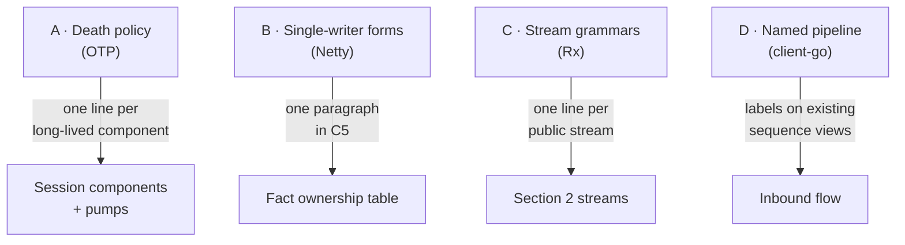
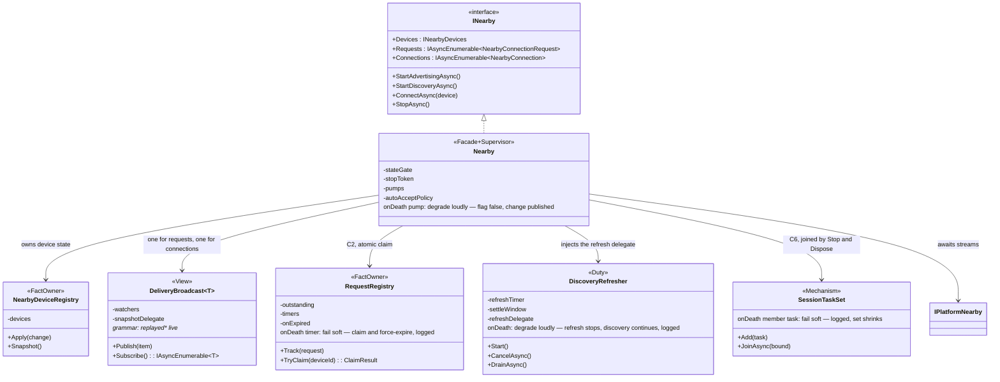

# Section 4 candidate increments

Four learnings from the systems survey (client-go, Netty, OTP, Rx), each attacked and
defended, with one suggested class view at the end. Compare that view against
`docs/ARCHITECTURE.md` → §4 → *Class view — facade and session components*. The headline:
**no increment adds a component.** Every box in §4 survives unchanged — the increments are
annotations (policies, grammars, names) on the shape you already approved.

## Where each increment attaches



## A — Death policy per long-lived component (OTP)

Every component that runs work declares what its failure means, from a closed set:
**restart** · **degrade loudly** (stop, flip observable state, report on the change
stream) · **fail soft** (absorb, log, continue).

- **Attack.** Our components are not OTP processes: they share the registry, so a blind
  restart can resurrect stale state. A policy table is one more artifact that can rot, and
  most answers will be "log it" anyway.
- **Defend.** The silent-death class is real and already shipped — the consumer audit's
  "mysterious failure" paths are exactly components dying quietly. The repo's own gold
  standard exists (the iOS backgrounding teardown fails *loudly*: flags observably false,
  devices observably changed). One declared line per component makes that standard total,
  and the declaration is testable.
- **Verdict: adopt.** No restarts in 1.0 — every policy is *degrade loudly* or *fail
  soft*, chosen per component. Restart stays out until something proves it needs it.

## B — Serialization by ownership (Netty)

Netty pins each channel to one thread forever: single-writer is structural, not reviewed.

- **Attack.** Rerouting the facade's mutations through per-device lanes is a refactor with
  no failing test behind it — the registry's lock already serializes correctly. This repo
  has a standing rule: claimed defects earn a failing test first.
- **Defend.** The principle still pays at zero cost: name the two sanctioned forms of
  single-writer this design uses — *lock-owned* (registry) and *lane-owned*
  (`KeyedSerialQueue`) — so a third ad-hoc form can't drift in unnoticed.
- **Verdict: adopt as one paragraph in C5. No restructuring.**

## C — Stream grammars (Rx)

Rx endures because of its grammar (`OnNext* (OnError|OnCompleted)?`), not its type names.
Give each public stream one grammar line, pinned by a unit test:

```text
Devices.Changes      := change*                      (ends only by cancellation)
Requests             := replayed* live*              (each exactly once per enumerator)
Connections          := replayed* live*              (same instance ConnectAsync returns)
ReceiveAsync         := payload* end                 (end = disconnect, after the tail)
AdvertisingChanges   := bool*                        (item is the new value)
```

- **Attack.** A grammar can overpromise (cross-stream ordering we cannot keep), and it is
  one more contract to hold in sync with XML docs.
- **Defend.** Five lines, each an executable test oracle — and writing them catches design
  bugs now (the `Requests` line forces the answer to "can a request be yielded after its
  expiry?"). The grammar promises only per-stream shape, never cross-stream order.
- **Verdict: adopt — five lines in §2, five tests.**

## D — Name the inbound pipeline (client-go)

client-go's stages (`Reflector → DeltaFIFO → Indexer → WorkQueue`) stay readable a decade
on because the pipeline is *named* and what flows between stages is designed (keys, not
objects). Ours is the same pipeline, anonymous: **adapter → channel → pump → owner →
broadcast**, with device ids (not objects) as the routing key.

- **Attack.** Prose labels without types can drift, and three-to-five stages may not earn
  the ceremony.
- **Defend.** The stages already exist — this names them once and labels the two existing
  sequence views. Zero new types, and the ids-not-objects rule becomes stated instead of
  accidental.
- **Verdict: adopt — one paragraph plus labels.**

## The suggested class view

Same boxes as §4, three changes visible: **archetype stereotypes** (the paused naming
thread — each class declares what kind of thing it is), **the renames the archetypes
imply** (`RequestRegistry`, `DiscoveryRefresher`, `Nearby`), and **an `onDeath` line per
long-lived component** (increment A). Grammars ride the two stream-bearing classes.



Reading the diff against §4's view: `NearbyImplementation` → `Nearby` (facade now also
*named* as the supervisor it already is — it constructs, injects, joins, and owns every
death policy), `RequestExpiryTracker` → `RequestRegistry` (the fact, not the timer),
`DiscoveryRefreshLoop` → `DiscoveryRefresher` (the duty, not the mechanism),
`SessionTaskSet` and both `Broadcast`s unchanged. Every relationship line is identical.

## Suggestion

Adopt A, C, D, and the archetype naming in one §4 pass. Adopt B as a C5 paragraph only.
Total cost: renames (internal, zero PublicAPI impact), five grammar lines with tests, one
policy line per component, labels on two diagrams. Total new components: zero.
