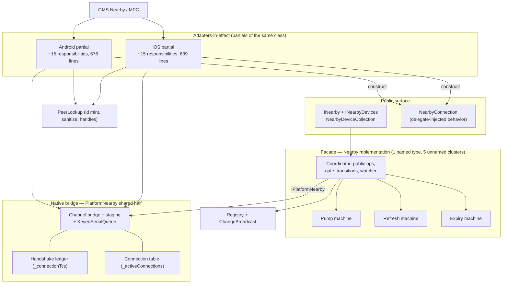

# Architecture re-assessment — component boundaries and overlap

Date: 2026-08-25. Scope: the component decomposition of `src/Plugin.Maui.NearbyConnections/`,
judged against SOLID, enterprise DI practice, and an interface-first bar. This pass reports. It
changes no code. `ARCHITECTURE-REVIEW.md` (2026-08-24) is treated as symptom evidence. This
document names the disease and the decisions.

Confidence labels, same discipline as the prior review:

- **confirmed** — the cited code proves the claim by inspection.
- **needs-failing-test** — the mechanism is visible in code, but no test reproduced the
  consequence yet.

One term per concept, used throughout:

| Term | Means | Lives in |
|---|---|---|
| facade | `NearbyImplementation` | `NearbyImplementation.{cs,state.cs,log.cs,ios.cs}` |
| bridge | the shared half of `PlatformNearby` | `Native/PlatformNearby.{shared,events}.cs` |
| partials | the per-SDK halves of `PlatformNearby` | `Native/PlatformNearby.{android,ios}.cs` |
| lookup | `PeerLookup` | `Native/PeerLookup.{cs,android.cs,ios.cs}` |
| registry | `NearbyDeviceRegistry` | `Devices/NearbyDeviceRegistry.cs` |
| MPC | Apple MultipeerConnectivity | — |
| GMS Nearby | Google Nearby Connections | — |
| TCS | `TaskCompletionSource` | — |

All six mechanical checks in `.claude/rules/naming.md` §10 were re-run on 2026-08-25 and pass:
no vendor types in the PublicAPI baselines, no banned vocabulary, no public types in `Native/`,
no `Nearby`-prefixed methods, no platform-identifier vocabulary outside its own partial, and all
three baselines byte-identical (207 lines, 29 public types).

---

## Verdict

**The maintainer's position — "too many overlapping parts" — is half right.** The overlap half
is confirmed. The count half is backwards.

The system does not have too many parts. It has **too few named parts for its responsibility
set**. Section 1 counts 26 de-facto components. Only 14 have a name and a type of their own.
The other 12 are clusters of state and behavior inside the facade and the platform layer. New
work lands in the two largest classes because it has no named home, and each landing adds
another co-owned fact or another prose rule. The overlap is the symptom. The disease has two
parts:

1. **State facts without single owners.** Section 2 lists six facts with two to four owners
   each. Every one has a divergence window or an implicit reconciliation protocol.
2. **Load-bearing contracts without enforcement.** The platform event surface, the
   drain-then-release rule, and the fire-and-forget ownership rules are prose. The prose's two
   authority documents do not exist, and the decay has spread into `AGENTS.md` and code
   comments.

Merging parts would therefore make this worse, and so would adding layers. The target in
section 3 is the as-is decomposition plus seven scoped fixes, each of which either gives a fact
one owner or turns a prose contract into a type.

### Hypothesis outcomes

| # | Hypothesis | Outcome | Anchor evidence |
|---|---|---|---|
| H1 | The declared structure has fewer components than the responsibility set | **confirmed, sharpened** — four machines in the facade, not three | `NearbyImplementation.state.cs:344-397` (the pump machine the prior review folded into "the session's actual job") |
| H2 | State facts lack single owners | **confirmed, extended** — six co-owned facts, not two | §2.1, including the `started` TCS with writers on both sides of the seam |
| H3 | Boundaries are defined in prose, and the prose decayed | **confirmed, worse than reported** — 8 dangling document references plus decay inside `AGENTS.md` and code comments | §2.3 |
| H4 | The partial-pair duplication is the symptom of a missing seam | **confirmed** — all six slips present, parity maintained by comments | `PlatformNearby.android.cs:577-578` names its iOS sibling in a comment |
| H5 | *(new)* The missing public-side component is a connection-delivery seam | **confirmed** — the README's headline scenario needs a 236-line consumer service | §4.2, `samples/NearbyChat/Services/NearbyIngestionService.cs` |

### Relation to the prior review

This pass confirms the prior review's facts everywhere it re-checked them. It moves four of its
judgments:

- **F-9 sharpened.** The facade holds four machines, not three. The pump lifecycle machine
  (`PumpState`, `StartPump`, `StopPumpAsync`, the two pump loops) is a self-contained
  start/stop/restart engine with its own state and its own TCS-handoff protocol.
- **F-6 extended.** The fire-and-forget census is eight sites, not five. Six have no owner at
  disposal (§2.3).
- **R-5 adapted, not adopted verbatim.** One outbound adapter interface, no second inbound
  interface. Section 3 adds an argument the prior review missed: the adapter closes
  `docs/DEVICE-LIFECYCLE.md` open question 7 without changing what platform-unsupported means.
- **The "Connections" question reopened in part.** `docs/DEVICE-LIFECYCLE.md` open question 5
  settled "no second collection". Section 5 (D3) recommends a connection *stream*, which is not
  a second collection and does not reintroduce the disagreement risk that settled the question.

---

## 1. As-is component map

A component here is a cluster of state and behavior with one reason to change. A file is not a
component, and neither is a class that holds five of them.



The map below lists every de-facto component. "Named" means the component is its own type.
"Unnamed" means it is a cluster inside another class, with its state fields listed as the proof
that it is a component and not a method group.

### Named components (14)

| Component | Lives in | State it owns | Depends on |
|---|---|---|---|
| Facade coordinator | `NearbyImplementation.cs` | `_stateGate`, `_isAdvertising`/`_isDiscovering`, `_disposing` | `IPlatformNearby`, registry, options |
| Device registry | `Devices/NearbyDeviceRegistry.cs` | `_devices`, `_snapshot`, `_unconfirmed` | `ChangeBroadcast` |
| Change broadcast | `ChangeBroadcast.cs` | `_watchers` (one channel per enumeration) | channels |
| Keyed work queue | `Native/KeyedSerialQueue.cs` | `_tails` | thread pool |
| Lookup, shared half | `Native/PeerLookup.cs` | `_peers` | `RandomNumberGenerator` |
| Lookup, Android half | `Native/PeerLookup.android.cs` | `_deviceIdByEndpoint`, `_endpointByDeviceId` | — |
| Lookup, iOS half | `Native/PeerLookup.ios.cs` | `_handles`, `_deviceIds` (weak table) | `MCPeerID` identity |
| Connection object | `Connections/NearbyConnection.cs` | receive channel, `_disconnectedTcs`/`_disconnectedCts`, two guards | three injected delegates |
| Connection request | `Connections/NearbyConnectionRequest.cs` | none — two delegates | partial-built closures |
| Outgoing transfer tracker | `Transfer/OutgoingTransfer.cs` | `_tcs`, `_inactivityCts`, `_lastProgress` | `TimeProvider` |
| Lifecycle observer (iOS) | `Native/AppLifecycleObserver.ios.cs` | `_backgroundRegistration`, `_tearDown` | facade `StopAsync` |
| Control-message codec | `Connections/ControlMessage.cs` | none | — |
| Options and rules | `Options/*` (12 files) | mutable option values | `ServiceIdRules`, `DisplayNameRules` |
| Composition root | `ServiceCollectionExtensions.{cs,android,ios,net}.cs`, `MauiAppBuilderExtensions.cs` | none | validator, `PlatformNearby` ctor |

### Unnamed components (12) — clusters inside another class

| Component | Hides inside | State it owns | Evidence |
|---|---|---|---|
| Pump machine | facade | per-pump `Cts`/`Task` in `PumpState`, the `started` TCS handoff | `state.cs:30-86,344-397` |
| Discovery refresh machine | facade | `_refreshCts`, `_refreshTask`, the 2 s settle window | `NearbyImplementation.cs:32-33`, `state.cs:252-342` |
| Request expiry machine | facade | `_pendingRequests`, `_requestExpiries` | `NearbyImplementation.cs:17-20`, `state.cs:132-197` |
| Auto-accept policy | facade | none — a branch plus an untracked task | `state.cs:115-118,199-216` |
| Disconnect watcher | facade | the facade's `_activeConnections` | `state.cs:218-247` |
| Channel bridge | bridge | `_advertiseChannel`, `_discoverChannel`, the `Step<T>` swap | `shared.cs:61-82,228-265` |
| Handshake ledger | bridge | `_connectionTcs` | `events.cs:99-152`, `shared.cs:152-194` |
| Connection table | bridge | the platform's `_activeConnections`, `_unobservedWarned` | `shared.cs:26`, `events.cs:185-230` |
| Inbound file staging | bridge + per-platform path | the process-wide `StagingDirectory` | `events.cs:10-20,253-373` |
| Android SDK adapter-in-effect | Android partial | `_advertiseClient`, `_discoverClient`, `_incomingPayloads`, `_outgoingTransfers` | `android.cs:8-11` |
| iOS SDK adapter-in-effect | iOS partial | `_session`, `_localPeerId`, `_mcAdvertiser`, `_mcBrowser`, `_progressObservers`, `s_nextPayloadId` | `ios.cs:5-13` |
| Android file-name resolution | Android partial | none | `Native/PlatformNearbyFileNames.android.cs` |

Two readings of this table matter:

- **The codebase already extracts hidden components when they hurt.** `ChangeBroadcast` and
  `KeyedSerialQueue` are recent extractions (`KeyedSerialQueue` in commit 257b589), and both are
  the best-bounded components in the tree. The remaining 12 are the same phenomenon, unextracted.
- **All 12 unnamed clusters live inside two classes.** `NearbyImplementation` holds five and
  `PlatformNearby` holds seven — the two places the prior review found responsibility counts
  of twelve and fourteen. The counts verify: the Android partial carries ~15 responsibilities
  in 676 code lines, the iOS partial ~15 in 639. The single-responsibility violation is not academic. Its consequence is §2.2: parallel
  responsibilities kept in sync by hand, and comments doing a compiler's job.

---

## 2. Overlap register

The direct test of the thesis. Three kinds of overlap, each with owners and consequences.

### 2.1 Facts with more than one owner

| Fact | Owners | Divergence window | Label |
|---|---|---|---|
| "Device X has a live connection" | ① platform table (`shared.cs:26`, written `events.cs:129`, removed `events.cs:187`) ② facade dictionary (`NearbyImplementation.cs:21-22`, written `state.cs:220`, removed `state.cs:232-234`) ③ registry `Status = Connected` (`state.cs:222`) ④ `NearbyConnection.Disconnected` (`NearbyConnection.cs:58`) | Three known windows, below | confirmed (windows: needs-failing-test) |
| "Advertising/discovery started" | the `started` TCS has five writers in two components: bridge `Step<T>` (`shared.cs:247,251`) and the facade pumps (`state.cs:42,46,52`) | none observed — `TrySet*` makes the race benign, but the writer-per-case protocol exists only in heads | confirmed |
| "Peer identity for device id" | lookup `_peers` (`PeerLookup.cs:9`) and registry `_devices` (`NearbyDeviceRegistry.cs:23`) both store a `NearbyDevice` per id, added and removed on independent paths | `OnDisconnected` removes the lookup entry (`android.cs:154`) while the registry row survives until the facade watcher runs | confirmed |
| "Inbound request outstanding for X" | ① facade `_pendingRequests` ② facade `_requestExpiries` ③ bridge `_connectionTcs` — Android registers it at `OnConnectionInitiatedAsync` (`android.cs:60`), before any caller exists ④ registry `Status = RequestReceived` | expiry, rejection, `StopAsync`, and platform disposal each clear a different subset in a different order | confirmed |
| "Where inbound files stage" | one process-wide static path (`events.cs:20`), shared by every `PlatformNearby` instance | two instances sweep each other's files at disposal — the cause of the device suite's forced serialization (`DeviceTests/AssemblyMarker.cs`) | confirmed |
| "The configured options" | one mutable `NearbyOptions` read at different times per platform: Android per start (`android.cs:22-23`), iOS `DisplayName` captured at first peer creation (`ios.cs:30`) but `ServiceId` per start (`ios.cs:45,184`) | a post-registration mutation takes full effect on Android and partial effect on iOS, and bypasses validation (prior review F-5) | confirmed |

The three connection-fact windows:

1. **The cancelled-connect orphan** (prior review F-2, re-verified). `AwaitHandshakeAsync` has
   two failure exits. The deadline exit abandons the platform attempt (`shared.cs:174-188`).
   The catch-all exit removes the TCS and rethrows (`shared.cs:189-193`) and abandons nothing.
   A caller-cancelled connect can therefore leave a live GMS handshake, and a winning
   `ResolveConnectionTcs` puts the connection in the platform table only. Mechanism confirmed.
   Consequence needs-failing-test.
2. **The `StopAsync` stale-read window.** `StopAsync` disposes each connection
   (`NearbyImplementation.cs:249-259`). The facade dictionary empties only when each
   `WatchDisconnectAsync` wakes on the thread pool. Until then `TryGetConnection` answers
   `true` with a disposed connection whose platform half is already released. Mechanism
   confirmed. Consumer-visible consequence needs-failing-test.
3. **Double teardown by design.** `StopAsync` and the platform's `DisposeAsync`
   (`shared.cs:126-140`) both own "dispose every active connection". Idempotence makes the
   overlap safe. It also means teardown correctness rests on idempotence in four types at once.

### 2.2 Responsibilities with more than one home

The six sibling slips from the prior review's F-4 all still exist, re-verified:

| Responsibility | Android home | iOS home | Status |
|---|---|---|---|
| Lost-device handling with connected-suppression | `android.cs:208-236` | `ios.cs:218-246` | 25 near-identical lines |
| Found-device handling | `android.cs:194-206` | `ios.cs:202-216` | same shape |
| Send-file terminal catch ladder | `android.cs:599-617` | `ios.cs:411-428` | **behavioral divergence**: Android filters `ex is not OperationCanceledException and not NearbyException` (`android.cs:610`), iOS filters only `ex is not NearbyException` (`ios.cs:421`) — a foreign `OperationCanceledException` surfaces raw on Android and wrapped on iOS. Mechanism confirmed. Consumer-visible difference needs-failing-test. |
| Terminal progress report | `android.cs:579-588` | `ios.cs:388-399` | kept aligned by the comment "Mirrors the iOS Report helper" (`android.cs:577-578`) |
| Unobserved-fault retirement | `android.cs:629` | `ios.cs:432` | kept aligned by the comment "The iOS sibling does the same" (`android.cs:625-628`) |
| "not currently visible" fault | `android.cs:426-428` | `ios.cs:257-258` | byte-identical exception string in two files |

Add one the prior review did not list: **connection assembly**. Both partials hand-build the
same `NearbyConnection` closure bundle — `android.cs:116-125` and `ios.cs:501-527` — with no
shared helper. The dispose closures differ for platform reasons, the rest does not.

Two comments doing sync duty is the load-bearing observation. The compiler checks that each
`Platform*` partial method exists per platform. It checks nothing about the behavior above
those methods, so parity depends on a reviewer who greps the sibling — the dependence
`AGENTS.md` itself names as the dominant defect class.

### 2.3 Load-bearing contracts with no compile-time or test-time enforcement

| Contract | Declared where | Enforcement today | Decay found |
|---|---|---|---|
| The platform event surface (SDK callbacks in → channel/TCS/registry effects out) | prose, `AGENTS.md` → device tests | device tests only — nothing off-device, nothing at compile time | the `net10.0` stub throws before enumeration, so the bridge's channel-swap is untestable off-device (`test/.../Native/PlatformNearbyTests.cs:13-26`, `docs/DEVICE-LIFECYCLE.md` → Open questions item 7) |
| Drain, then release | prose, `AGENTS.md`, deferred to `docs/CONCURRENCY.md` | `KeyedSerialQueue` types the platform half — the rule itself is prose | `docs/CONCURRENCY.md` does not exist. Four live references: `AGENTS.md:325,350,564`, `Native/KeyedSerialQueue.cs:42` |
| The outstanding-work list | `docs/PLATFORM-ABSTRACTION-REVIEW.md` §3, per `DESIGN-PRINCIPLES.md` | none — the document does not exist and the issue tracker is closed | four references: `DESIGN-PRINCIPLES.md:15,18,75`, `docs/DEVICE-LIFECYCLE.md:12` |
| Fire-and-forget ownership | prose, deferred to the missing `docs/CONCURRENCY.md` | none | census below — eight sites, six unowned |
| Sibling parity | comments naming the other platform | reviewer memory | §2.2 |
| Architecture prose accuracy | `AGENTS.md` | none | `AGENTS.md:243` cites `NearbyDeviceRegistry.Subscribe`, which moved into `ChangeBroadcast`. The folder layout omits `ChangeBroadcast.cs`, `KeyedSerialQueue.cs`, and `PlatformNearby.events.cs`. `android.cs:722` cites `PlatformQuiesceConnectionAsync`, which no longer exists. |

Fire-and-forget census, 2026-08-25 (`_ =` discards of live work, `out _` excluded):

| Site | Owner at disposal | Class |
|---|---|---|
| `_ = AutoAcceptAsync(...)` — `state.cs:117` | none — observes `_disposing.Token` (`state.cs:206`) but nothing awaits it | unowned |
| `_ = ExpireRequestAfterAsync(...)` — `state.cs:143` | none | unowned |
| `_ = WatchDisconnectAsync(...)` — `state.cs:223` | none | unowned |
| `_ = WatchAsync(changes)` — `NearbyDeviceCollection.cs:128` | cancel-only, never awaited | unowned |
| `_ = CancelPayloadLoggedAsync()` — `android.cs:596` | none | unowned |
| `_ = Await(release, deviceId)` — `shared.cs:213` | none — the release it wraps drains the queue, the wrapper itself is unawaited | unowned |
| `_ = _workQueue.Enqueue(...)` — `events.cs:60` | the queue — `DrainAllAsync` covers it at disposal | queue-tracked |
| `_ = queued.ContinueWith(...)` — `KeyedSerialQueue.cs:83` | self — the prune continuation | self-owned |

Six unowned sites against the prior review's five. Each one logs its own failure, which
satisfies the convention's letter. None has a written account of what disposal may assume,
because the document that was to hold that account does not exist.

### 2.4 What this section proves

The overlap is real and concentrated. Every co-owned fact in §2.1 sits on the facade↔bridge
axis or the bridge↔partial axis. Every unenforced contract in §2.3 exists because a component
boundary was drawn in prose instead of in a type. And §2.2 shows the cost of the one boundary
drawn in neither: the two partials are one class, so the compiler cannot see the pairing at
all. The thesis "too many overlapping parts" resolves to: **the right number of parts, too few
of them named, and six facts owned by more than one of them.**

---

## 3. Target decomposition

Target = as-is + 7 scoped fixes. No new layers. One new internal interface, which pays for
itself under the interface-first bar. Three public-surface questions are deliberately not
settled here — they go to section 5, because only the maintainer can price them.

The evaluation criteria drive each fix: a single owner per fact (SRP applied to state), a
compiler-checked platform contract (OCP/DIP for the planned MPC exit), and substitution points
that match the variation points (LSP/ISP for the `net10.0` stub).

### The fixes, in migration order

**Fix 1 — restore the written contracts.** Write `docs/CONCURRENCY.md` with the drain-site
inventory and the fire-and-forget census from §2.3, or fold both into `AGENTS.md` and delete
the references. Repair the eight dangling references, the two stale code comments
(`android.cs:722`, `AGENTS.md:243`), and the folder-layout omissions. Pick one home for the
work list (section 5, D9). This goes first because every later fix needs a place to be tracked.
Zero code risk.

**Fix 2 — snapshot the options at the boundary** (prior review F-5, verdict unchanged).
`AddNearby` validates, then captures an immutable copy. One owner for the configuration fact.
The public doc sentence on `NearbyOptions` becomes true.

**Fix 3 — abandon on every failed handshake exit** (prior review F-2, verdict unchanged). The
catch-all exit of `AwaitHandshakeAsync` runs the same abandon-and-release the deadline exit
runs. Add the device test the prior review specified. This is the one candidate correctness
defect, and it must land before fix 4 because it decides what "remove from the table" means on
a failure path.

**Fix 4 — one owner for the connection table.** The platform side owns it: the partials create
every connection (`android.cs:118`, `ios.cs:503`) and the bridge already keys payload routing
on it (`events.cs:213`). Delete the facade's `_activeConnections`. `TryGetConnection` and the
`StopAsync` enumeration go through `IPlatformNearby` — roughly two internal members. The
disconnect watcher keeps only its registry transition. This removes §2.1's fact ①/② split and
closes the `StopAsync` stale-read window, because the one remaining table empties inside
`ReleaseConnectionAsync`, before disposal returns. The prior review's alternative — a
connection-ended stream replacing the per-connection watcher — costs a new pump for the same
result. Take the smaller change.

**Fix 5 — extract the two machines that own timers, and give session tasks an owner** (prior
review F-9 + F-6, sharpened by H1). Extract `DiscoveryRefreshLoop` and `RequestExpiryTracker`
as internal classes constructed by the facade — each owns its state, its timer, and its failure
modes, and each is testable alone. Keep the pump machine and auto-accept inline: the pump *is*
the facade's one reason to change (how public operations map onto platform streams), and
auto-accept is eight lines. Add a small bounded-join set for the session-owned tasks
(`AutoAcceptAsync`, `WatchDisconnectAsync`) that `DisposeAsync` awaits with a constant bound —
the same shape `KeyedSerialQueue` already gives the platform layer. That set is the typed form
of half the missing `docs/CONCURRENCY.md`.

**Fix 6 — instance-scope the staging path** (prior review F-7/R-7, verdict unchanged).
`StagingDirectory` becomes an instance partial property with a per-instance subdirectory, and
`s_nextPayloadId` becomes an instance field. Removes the last process-wide mutable fact.
Whether the device suite then re-parallelizes is a separate choice — `AGENTS.md` documents
real reasons to stay serial.

**Fix 7 — the platform adapter seam** (R-5: **adapt**). The largest change, last, because
fixes 3–5 shrink what moves.

*The shape.* One internal interface — call it `IPlatformAdapter` — whose members are today's
`Platform*` list: start/stop advertising, start/stop discovery, initiate/respond/abandon
connect, send bytes, send file, release, availability, dispose, staging path. That list is
already an interface in effect, expressed as partial methods, and it has been stable. The
bridge becomes one non-partial sealed class: channels, the handshake ledger, the connection
table, the work queue, staging, release ordering, and the six §2.2 shapes hoisted above the
adapter (the adapter reports "peer lost", the bridge applies connected-suppression once). The
inbound direction stays concrete: each adapter holds the bridge and calls the same internal
methods the partials call today, so the device tests keep their entry points — real adapter
callbacks in, channel/TCS/registry effects out. The lookup stays as-is: its partial split never
slipped, which makes it the proof that partials work when the per-platform half is small.

*Why adapt beats adopt-verbatim.* The prior review's version implied the event surface might
also become a type. It should not. The inbound contract is exactly what the device tests
execute, and a second interface would be a seam with one implementation per direction — it
fails the interface-first bar the moment the outbound interface exists.

*Why adopt at all, against the "fewer parts" thesis.* Four reasons, two of them new here:

1. It is the only fix that deletes §2.2 rather than patching it. Six responsibilities get one
   home. The parity comments go away because there is nothing left to keep parallel.
2. The interface passes the bar with margin: four implementations — Android, iOS, a throwing
   `net10.0` adapter, and a scripted test adapter.
3. *(new)* It closes `docs/DEVICE-LIFECYCLE.md` open question 7 without changing what
   platform-unsupported means. The question's own candidate fix — a `net10.0` stub that yields
   an empty completed stream — would make `StartAdvertisingAsync` silently succeed on
   `net10.0`, the exact failure mode `AGENTS.md`'s first principle ranks worse than absence.
   A scripted adapter lets unit tests enumerate the bridge's swap, ledger, and release logic on
   `net10.0` while the shipping stub keeps throwing. The substitution point finally matches the
   variation point, which is the LSP/ISP complaint in one sentence.
4. It converts the MPC exit from an in-class rewrite into a bounded one. Apple deprecated MPC,
   and the migration to Network.framework is planned post-1.0. Today that migration edits
   files of the same class that holds every shared invariant — `_connectionTcs` and the
   channels are in reach of any line of `ios.cs`. With the seam, the migration writes one new
   adapter against a compiler-checked contract and touches nothing shared. That is the
   open/closed test case from the task brief, answered.

*Cost, stated honestly.* Churn in the two largest files. One new internal interface. A risk
that the first cut of the contract is wrong — mitigated by the fact that the `Platform*` list
has not moved in the recent history of the codebase. Net type count rises by about five
(interface, two adapters, throwing adapter, scripted adapter) while twelve unnamed clusters
drop to roughly five — named coverage goes up, conceptual part count stays flat, and
`PlatformNearby.net.cs` is deleted outright.

### What becomes a type, what stays prose

| Contract (§2.3) | After the fixes |
|---|---|
| Platform event surface, outbound half | a type — `IPlatformAdapter` (fix 7) |
| Platform event surface, inbound half | prose + device tests, unchanged, deliberately |
| Fire-and-forget ownership, facade half | a type — the bounded-join set (fix 5) |
| Fire-and-forget ownership, platform half | already a type — `KeyedSerialQueue` |
| Drain, then release | prose, restored and accurate (fix 1) — the prior review's R-8 reasoning holds until fix 7 lands, then one bridge owns all drain sites and a type is worth revisiting |
| Work list | one named home (D9) |

### What this pass verified and left alone

The prior review's §4 non-findings were re-checked and hold: injected `TimeProvider`
throughout, no service locator, no stored `IServiceProvider`, `TryAdd` respecting host
overrides, and all three existing interfaces earning their place (`INearby` /
`IPlatformNearby` / `INearbyDevices` each have a real second implementation in
`TestSupport/` — `StubNearby`, `FakeNearby`, `FaultingDevices`). No speculative abstraction
was found. The DI story would pass review at a library shop today. The lookup, the registry,
`ChangeBroadcast`, `KeyedSerialQueue`, and `OutgoingTransfer` are well-bounded and stay
untouched.

---

## 4. Consumer-lens audit

Framework: "What makes a good software library" (Jon P Smith, thereformedprogrammer.net).

### 4.1 Taxonomy

On the happy path this library is **elegant tending clever**: minted device ids, absorbed
timeouts, and a four-state device model hide two SDKs completely, and the XML docs carry the
contracts. The channel pumps are the clever part — invisible when they work, and the failure
paths are where clever becomes **mysterious**. Three paths qualify. Magic that fails becomes
mysterious exactly here:

| Failure path | What the consumer sees | Evidence | Label |
|---|---|---|---|
| Payloads arrive before any consumer exists | messages silently never appear — payloads buffer in an unbounded channel per connection, forever. The only breadcrumb is one Warning (`LogPayloadArrivedUnobserved`, `events.cs:219-222`). This already cost a real debugging session in the sample app. | `NearbyConnection.TryWritePayload`, `events.cs:224` | confirmed |
| Discovery refresh evicts a slow re-reporter | a present device blinks out of the bound list and back in — the refresh restarts discovery every 30 s (`NearbyOptions.cs:109`), waits a 2 s settle (`NearbyImplementation.cs:5`), then evicts anything not re-reported (`state.cs:337-342`) | `state.cs:283-342` | needs-failing-test |
| A second `AddNearby` call | nothing — the second delegate's options are validated, then silently discarded by `TryAddSingleton` | `ServiceCollectionExtensions.cs:93-102` | confirmed |

The counter-example worth naming: the iOS backgrounding teardown is magic that fails *loudly*
— one Information log, flags observably `false`, devices observably `Visible`
(`Native/AppLifecycleObserver.ios.cs`). That is the standard the three paths above should meet.

### 4.2 Common cases first — the 80/20 test

**Scenario A: advertise + auto-accept + receive.** The minimal correct consumer:

```csharp
builder.UseNearby(o => { o.ServiceId = "myapp"; o.AutoAcceptConnectionRequests = true; });
builder.Services.TryAddEnumerable(
    ServiceDescriptor.Singleton<IMauiInitializeService, Ingestion>());

sealed class Ingestion(INearby nearby) : IMauiInitializeService
{
    public void Initialize(IServiceProvider _) => _ = WatchAsync();

    async Task WatchAsync()
    {
        var consuming = new HashSet<string>(StringComparer.Ordinal);
        await foreach (var change in nearby.Devices.Changes)
        {
            if (change.Action is not NearbyDeviceChangeAction.Removed
                && change.Device.Status is NearbyDeviceStatus.Connected
                && consuming.Add(change.Device.Id)
                && nearby.TryGetConnection(change.Device.Id, out var conn))
            {
                _ = ConsumeAsync(conn, consuming);
            }
        }
    }

    static async Task ConsumeAsync(NearbyConnection conn, HashSet<string> consuming)
    {
        await foreach (var payload in conn.ReceiveAsync()) { /* handle */ }
        consuming.Remove(conn.RemoteDevice.Id);
    }
}
// ...plus StartAdvertisingAsync from a page or service.
```

**Verdict: fails the 80/20 rule.** The consumer must know five things the library could know
for them: `Changes` does not replay, so the watcher needs `IMauiInitializeService`. The stream
carries status transitions, not connection events, so a dedupe set is required or payloads
process twice. The connection is fetched by a separate racy lookup. `ReceiveAsync` must not
receive `DisconnectedToken`. The set must be pruned. The README's own quickstart elides all of
this behind the comment "// Open a receive loop per connected device"
(README.md → *Start watching before the first connection*), and the complete version —
`samples/NearbyChat/Services/NearbyIngestionService.cs` — is 236 lines. The abstraction
absorbed both SDKs and then handed the consumer an assembly puzzle. Section 5, D3.

**Scenario B: discover + connect + send.**

```csharp
if (await nearby.CheckAvailabilityAsync() is not NearbyAvailability.Ready) { /* fix & return */ }
await nearby.StartDiscoveryAsync();
await foreach (var change in nearby.Devices.Changes.WithCancellation(token))
{
    if (change.Action is NearbyDeviceChangeAction.Added)
    {
        var conn = await nearby.ConnectAsync(change.Device);
        await conn.SendAsync("hello"u8.ToArray());
        break;
    }
}
```

**Verdict: passes.** `ConnectAsync` returns the connection directly, the timeout is absorbed
on both platforms, and failure is one typed exception family. The residual burden is permission
choreography, which `CheckAvailabilityAsync` plus the README's per-platform sections carry.

**Scenario C: watch the device list in UI.**

```csharp
Rows = new NearbyDeviceCollection<NearbyDevice>(
    nearby, marshal: a => dispatcher.Dispatch(a), project: static d => d);
```

**Verdict: passes.** One constructor, disposal is the only cleanup, and it is the one type
allowed to know a UI thread exists.

### 4.3 Least astonishment

Behaviors a competent MAUI developer would not predict, each with a verdict:

| # | Astonishment | Verdict |
|---|---|---|
| 1 | `Devices.Changes` never replays, and the lazy singleton means a late watcher misses everything, payloads included | **redesign** — this is D3's first half. Documentation exists (README, `ServiceCollectionExtensions.cs:57-65`) and demonstrably was not enough. |
| 2 | Payloads for an unconsumed connection buffer invisibly, bounded by nothing | **redesign-adjacent** — falls out of D3. Interim: raise the one Warning to a repeated or Error-level signal. |
| 3 | `ReceiveAsync` is callable once per connection, and a second call throws | **keep, documented** — the guard message itself teaches the fan-out pattern (`NearbyConnection.cs:367-374`). |
| 4 | Passing `DisconnectedToken` to `ReceiveAsync` discards tail payloads | **keep, documented** — the docs on both members say so. Absorbing it would change cancellation semantics dishonestly. |
| 5 | A renamed device keeps its first-seen name for the whole session | **keep, documented** — deliberate anti-relabeling defense, pinned by a test (`PeerLookup.cs:86-105`). |
| 6 | A present-but-slow device can blink out of the list on a discovery refresh | **document now, test then absorb** — needs the failing test from §4.1 before tuning the settle window. |
| 7 | `TryGetConnection` can return a disposed connection right after `StopAsync` | **redesign** — closed by fix 4. |
| 8 | Auto-accept skips `RequestReceived` entirely, and `AcceptAsync` then throws | **keep, documented** (`NearbyOptions.cs:241-249`). |
| 9 | Byte payloads cap at 32 KB on Android only | **keep, documented** — a named platform limit on the member (`NearbyConnection.cs:138-142`). |
| 10 | `StartAdvertisingAsync` is measurably slower on iOS — it waits out a 250 ms failure grace window | **keep, documented** — `NearbyAppleOptions.StartFailureGraceWindow` names the platform at the call site. |

### 4.4 Escape hatches

The library exposes no SDK handle, by design, and `Native/` public types are build-checked to
zero. The article's counter-argument: every non-trivial abstraction leaks, and a consumer with
a real need and no escape route abandons the library.

Scenarios that are impossible today, verified:

- **iOS session security identity.** `MCSession` is constructed with `identity: null!`
  (`ios.cs:128,267`). Certificate-based peer authentication cannot be expressed.
- **MPC invitation context.** `DidReceiveInvitationFromPeer` receives the inviter's `NSData`
  context and discards it (`ios.cs:106-110`). Pairing payloads in the invite cannot be read,
  and none can be sent.
- **MPC advertiser info dictionary.** Advertising always passes `info: null` (`ios.cs:44`).
  Discovery-time metadata cannot be published.
- **GMS stream payloads.** Only `Payload.Type.File` and bytes are handled
  (`android.cs:322-326`). A GMS streaming payload from a non-plugin peer is dropped.

**Verdict against the absorb/name/omit ladder: the omissions stand — today.** Each scenario
is real but unrequested, each is one-platform-shaped, and each would need a named platform
scope to be offered honestly (`options.Apple.SecurityIdentity`, an invite-context accessor on
the request). A raw-handle hatch is the one form to refuse: it would break the `Native/`
quarantine (tier-1) and forfeit the property that makes the MPC exit survivable — no consumer
code knows what an `MCPeerID` is. The policy worth writing down, so the next request gets a
fast answer, is D5: **escape hatches are named platform scopes or nothing, and the first
concrete consumer request is what opens one.**

---

## 5. Decision list

Choices only the maintainer can make. Ranked by cost of deciding *after* 1.0, not by effort.
Recommendations are stated so they can be rejected in one line. Implementation is a later pass,
gated on these.

**D1. Does a device change carry a failure reason?** `NearbyDeviceChange` is a positional
public record (`Devices/NearbyDeviceChange.cs`). Adding a reason later changes the primary
constructor, which breaks compiled consumers — this is the one decision that becomes a breaking
change the day 1.0 ships. `docs/DEVICE-LIFECYCLE.md` names it Gap 1 and leaves it open, and
`EndReason` already exists internally with the case analysis done (`Devices/EndReason.cs`).
**Recommendation:** decide the shape pre-1.0 — either add a nullable reason now or record that
1.x will carry a new change type instead. Cost of delay: breaking change or type fork.

**D2. One log category forever?** `docs/LOGGING.md` publishes the single category
`Plugin.Maui.NearbyConnections.INearby` as a contract. The prior review's R-9 says the window
to adopt per-type categories closes at the 1.0 tag, and this pass agrees.
**Recommendation:** keep the single category, close the question in writing. Cost of delay:
every consumer's filter breaks if it reopens later.

**D3. Does 1.0 ship a connection-delivery seam?** Section 4.2 scenario A fails the 80/20 test:
the most common consumer intent — react to each opened connection, consume its payloads —
requires an initializer service, a dedupe set, and a racy lookup. The facade already holds the
connection at the moment of truth (`OnConnected`, `state.cs:218-224`). A broadcast
`IAsyncEnumerable<NearbyConnection>` of opened connections (closure is already observable per
connection via `Disconnected`) deletes the whole assembly. **This overturns a tier-3 settled
decision** — `docs/DEVICE-LIFECYCLE.md` open question 5, "Does `Connections` survive — settled:
no" — with cause: that decision rejected a second stateful *collection* because two collections
could disagree. A delta stream is not a collection, holds no state to disagree with, and
carries the same instance `ConnectAsync`/`AcceptAsync` already return. **Recommendation:** add
the stream pre-1.0. Cost of delay: additive later, but the workaround pattern calcifies in
every early consumer and in the README that teaches it.

**D4. What is the escape-hatch policy?** Section 4.4. **Recommendation:** adopt "named
platform scopes or nothing, opened on the first concrete request" as written policy in
`DESIGN-PRINCIPLES.md`. A raw-handle hatch stays refused — it would touch the tier-1 `Native/`
quarantine, and that is flagged here as required. Cost of delay: a hatch granted ad hoc post-1.0
can never be withdrawn.

**D5. Adopt the adapter seam (R-5, adapted per §3 fix 7)?** Internal, so no API lock — the
cost driver is elsewhere: the MPC-to-Network.framework migration is planned post-1.0, and every
device test and unit test written between now and the seam is written against the shape the
seam replaces. **Recommendation:** adopt, sequenced last. If declined, execute the prior
review's fallback (shared helpers inside the partials for the six slips) and record the
`net10.0` swap gap as permanent — see D10. Cost of delay: grows per test and peaks at the
migration.

**D6. Which side owns the connection table?** Section 3 fix 4 says the platform side, and
fix 3 (the cancel-path abandon) must land first. **Recommendation:** platform owns, facade
queries. Cost of delay: the §2.1 windows ship in 1.0 binaries and become consumer-visible bug
reports.

**D7. Snapshot the options at registration?** Prior review F-5, unchallenged here.
**Recommendation:** yes, pre-1.0, because the public doc currently promises it and the code
does not deliver it. Cost of delay: an unmanaged iOS crash reachable by a documented-safe
mutation.

**D8. Migrate the unit suite to xUnit v3 (R-11's framework half)?** This pass adds one datum:
every fix above lands with new tests, so the migration's price rises with each deferred step.
**Recommendation:** decide now, and if adopted, migrate before the fix sequence starts, as the
prior review's sequencing already argued. The fakes stay regardless — `FakeNearby` and
`FaultingDevices` are load-bearing and no mocking library replaces stream-timing doubles.

**D9. Where does the work list live?** `docs/PLATFORM-ABSTRACTION-REVIEW.md` §3 is named by
four references and does not exist. GitHub issues are closed by decision. Two review documents
now float untracked at the repo root. **Recommendation:** pick one home — a restored §3-style
document or this document's section 5 — and repair all four references in the same commit as
fix 1. Cost of delay: none at 1.0, but every finding in both reviews currently has no durable
home, which is how the last work list vanished.

**D10. The `net10.0` stub's meaning** (`docs/DEVICE-LIFECYCLE.md` open question 7).
Subsumed by D5: the scripted adapter closes the gap with the shipping stub unchanged. If D5 is
declined, the question returns on its own, and the empty-stream candidate should be rejected
even then — a `StartAdvertisingAsync` that silently succeeds on `net10.0` is the "member that
silently does nothing" the first principle ranks worse than absence.
**Recommendation:** fold into D5.

**D11. `StartFailureGraceWindow`** — the open question in `DESIGN-PRINCIPLES.md` stays open
and untouched. Nothing in this document's target moves where the 250 ms window lives or what
value it holds. Surfaced here per the rule that open questions are raised, never settled
silently. The rename gate and published identity were likewise not examined — tier 1.

---

*End of re-assessment. Implementation is a separate pass, gated on D1–D10.*
