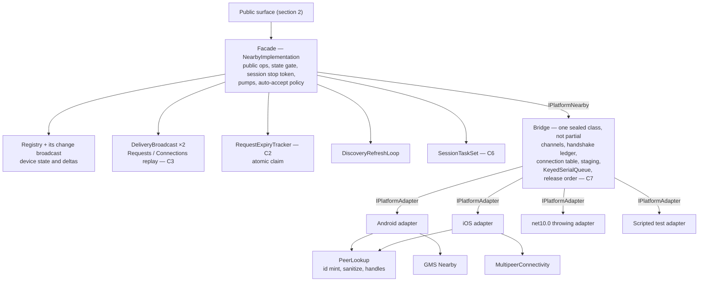
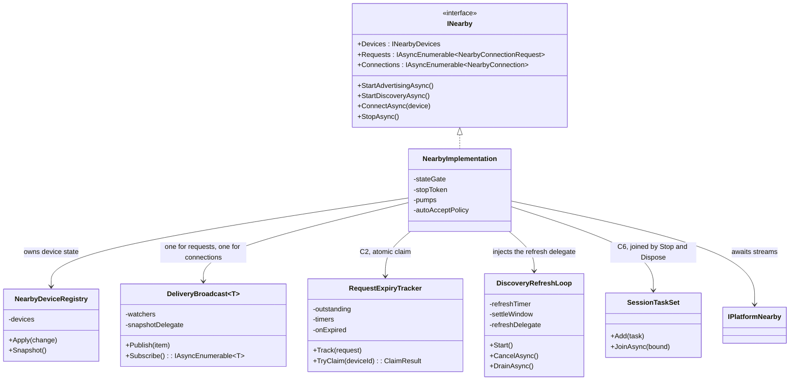
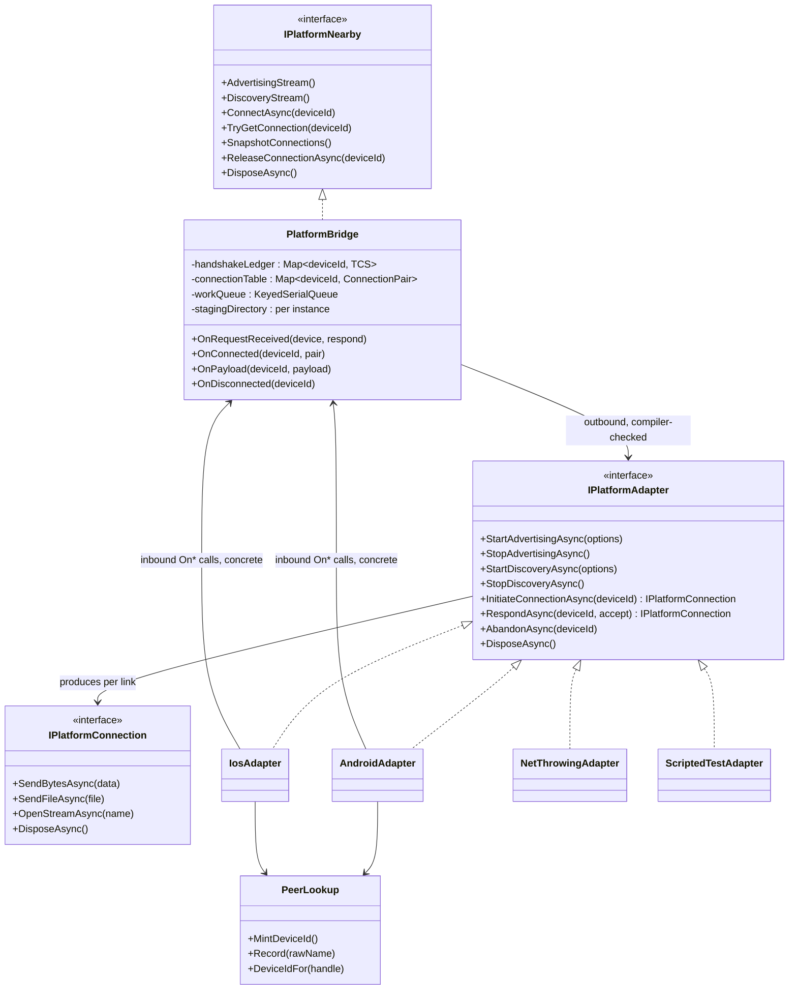
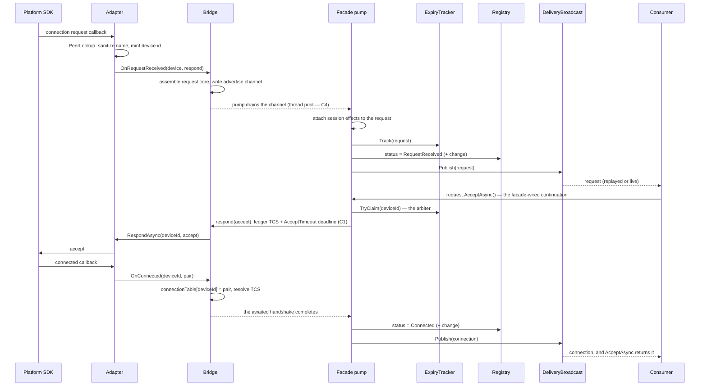
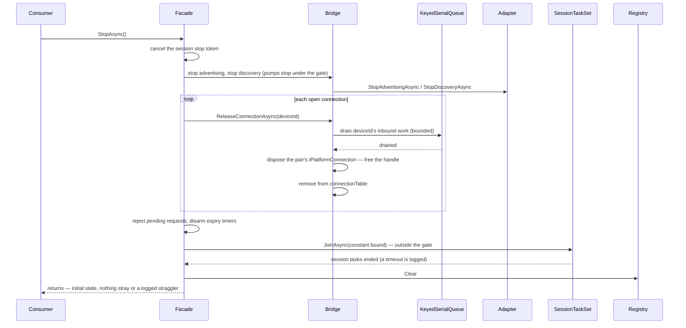

# Internal decomposition — Proposed

This is the amended section 4 of `docs/ARCHITECTURE.md`, produced by the 2026-08-25
adversarial pass. The audit trail is `ARCHITECTURE-DECOMPOSITION-DEFENSE.md`. Sections 1–3
are untouched and remain the acceptance criteria for this layer.

## 4. Internal decomposition — Proposed

This layer gives every responsibility a named home, so that new work lands in a component
instead of growing the two largest classes. The shape is judged by the contracts: each
section 3 contract must name the component that enforces it, and each state fact must name
its one owner (C5).

### The target component map

The arrows state the dependency rule: the bridge never calls a session component. Its only
upward path is its channels, which the facade's pumps drain on thread-pool threads. That rule
is what makes C4 true, and it is what keeps `Native/` free of session references at the
MultipeerConnectivity exit.

### The layers, and why each boundary sits where it does

**Facade.** Keeps only its one reason to change: how public operations map onto platform
streams. The pump machine and the eight-line auto-accept policy stay inline — extracting
them would create components with no independent reason to change. Everything else moves
out. Auto-accept's contract is explicit: the policy never calls `Track`, never publishes to
`Requests`, and is bounded by `AcceptTimeout` (C1) rather than `InboundRequestTimeout` (C2) —
there is no consumer decision window to bound. Each auto-accept task registers in
`SessionTaskSet` and runs on the facade's session stop token, which `StopAsync` and
`DisposeAsync` both cancel. All registry mutation and all delivery publication happen in the
facade — the components below act through delegates the facade injects.

**Session components, constructed by the facade.** Each owns its state, its timer, and its
failure modes, and each is testable alone on `net10.0`:

- `RequestExpiryTracker` — owns "an inbound request is outstanding for X", its expiry timer,
  and the atomic claim that settles accept, reject, and expiry. `Track(request)` records the
  fact. `TryClaim(deviceId)` resolves it, and exactly one caller wins: a winning accept or
  reject proceeds, a losing one throws `NearbyRequestExpiredException`, and a losing expiry
  timer returns without effect. Expiry effects — the reject, the `Expired` completion, the
  registry transition, the change publish — run inside an `onExpired` delegate the facade
  injects, so device-state mutation keeps one path. The tracker is constructed with the
  options snapshot, the `TimeProvider`, and that delegate. The C2 enforcement point.
- `DiscoveryRefreshLoop` — owns the refresh interval, the settle window, and eviction.
  Exposes `Start()`, `CancelAsync()`, and `DrainAsync()`. The facade injects one refresh
  delegate that stops and restarts the discover pump under the facade's state gate — the gate
  never leaves the facade. Eviction goes through the registry's own generation API.
- `SessionTaskSet` — the bounded-join set from C6. Tasks self-remove on completion. `Add`
  during a join is accepted, and `JoinAsync(bound)` loops until the set is quiet or the bound
  elapses. A join timeout is logged. `StopAsync` and `DisposeAsync` both join it, after
  connection disposal and before the registry clear, outside the state gate.
- `DeliveryBroadcast<T>` — the C3 seam: broadcast streams for `Requests` and `Connections`
  that replay what is still outstanding, then live arrivals. Same watcher pattern as
  `ChangeBroadcast`, plus the handover rule below. It holds no fact state — only a
  per-enumerator handover guard. Each instance is constructed with a snapshot delegate: the
  tracker's outstanding set for requests, `IPlatformNearby.SnapshotConnections()` for
  connections.
- `NearbyDeviceRegistry` and `ChangeBroadcast` — unchanged. They are the proof extraction
  works: both are recent extractions and both are the best-bounded components in the tree.

**The handover rule (C3).** At enumeration start the delivery enumerator subscribes first,
then reads the snapshot through its delegate, yields the snapshot, then yields live items and
suppresses any live item that is reference-equal to a snapshot member. The guard set is
bounded by the snapshot size and dies with the enumerator. Either other order fails C3: read
first and an item that arrives in the window is yielded zero times, subscribe first without
the guard and it is yielded twice.

**Bridge.** One sealed, non-partial class behind `IPlatformNearby`. It owns everything both
platforms share: the channels, the handshake ledger, the connection table, instance-scoped
file staging, `KeyedSerialQueue`, and the drain-then-release order (C7). The connection table
maps `deviceId` to the pair (`NearbyConnection`, `IPlatformConnection`) — one entry per link,
public object and platform object together, so release disposes both in order. The six
behaviors that today exist twice and are kept aligned by comments — lost-device suppression,
found-device handling, terminal catch ladders, terminal progress reports, unobserved-fault
retirement, connection assembly — are written once here, above the adapters. Connection
assembly is two-stage: the bridge builds the platform core (receive channel, respond and
dispose wiring), and the facade attaches the session effects (registry transition, delivery
publish, disconnect watcher) when its pump drains the item.

**Adapters.** One internal interface, `IPlatformAdapter`, whose members are today's
`Platform*` partial-method list — a contract that already exists in effect and has been
stable. Four implementations: Android, iOS, a throwing `net10.0` adapter, and a scripted
test adapter. The inbound direction stays concrete: adapters call the bridge's internal
methods. The SDK-typed entry points the device tests drive keep their signatures and relocate
into the adapter types, so the device suite constructs an adapter-bridge pair and asserts the
same channel, ledger, and registry effects. `PeerLookup` keeps its partial split — its
per-platform halves are small and have never slipped. Its shared half mints device ids, which
is what the scripted adapter uses on `net10.0`.

**Stream-name carriage (story S8).** Each adapter owns how a stream's name travels: an
in-band frame on Android, the native carrier on iOS. The bridge owns the platform-neutral
contract — an inbound stream arrives as a name-and-stream pair, assembled into
`NearbyStreamPayload` and delivered through the connection's receive channel. The in-band
frame format is a wire contract between peers of different plugin versions and is settled
before S8 ships (decision list, `ARCHITECTURE-DECOMPOSITION-DEFENSE.md`).

### Fact ownership (the C5 table)

Every fact has one owning component that holds and serializes it. Mutators route through the
owner's API. Everyone else reads or derives.

| Fact | Owner | Everyone else |
|---|---|---|
| Device presence, status, and the device change stream | Registry, its broadcast included | The facade and its injected delegates mutate through the registry's API. UI reads snapshots and deltas. |
| "Device X has a live connection" | Bridge connection table — `deviceId` → (`NearbyConnection`, `IPlatformConnection`) | Facade queries `TryGetConnection` and reads `SnapshotConnections()` through `IPlatformNearby`. `NearbyDevice.Status == Connected` is a derived view. `Disconnected` is a derived signal. |
| "Advertising / discovery started" | Bridge — `Step` resolves or faults it, on both branches | Facade pumps await it. The pump faults it only when the pump itself fails before `Step` runs — the one documented backstop, harmless late writes absorbed by `TrySet*`. |
| "Inbound request outstanding for X" | `RequestExpiryTracker` — the atomic claim settles accept, reject, or expiry, and exactly one wins | Handshake ledger holds only the accept-in-progress TCS. Registry status is a derived view. Auto-accept never creates the fact. |
| Live session tasks (auto-accept, disconnect watchers) | `SessionTaskSet` | `StopAsync` and `DisposeAsync` join it. A bare task discard outside the two owning types fails review (C6). |
| Peer identity and platform handles | `PeerLookup` | Nothing above `Native/` sees a platform identifier. The shared half mints ids for the scripted adapter too. |
| Inbound file staging path | Bridge, per instance | No process-wide static remains |
| How a stream's name travels | The platform adapter — in-band frame on Android, native carrier on iOS | The bridge sees only name-and-stream pairs. The frame layout is a wire contract, settled pre-S8. |
| Configured options | Immutable snapshot captured at registration | Everyone reads the snapshot |

The delivery streams own no fact. A `DeliveryBroadcast<T>` enumerator holds only its handover
guard, and the guard dies with the enumerator.

### What this closes

- The connection-table split and its stale-read window: one table, emptied inside release,
  before disposal returns.
- The accept-versus-expiry race: one atomic claim, so a consumer can never observe both a
  connection and an expired request.
- The replay window: the handover rule makes C3's "exactly once per enumerator" a mechanism,
  not an aspiration.
- The stray-task write into a next session: teardown cancels, joins, and only then clears,
  and a join timeout is logged instead of silent.
- The sibling-parity defect class: the six duplicated behaviors have one home, so there is
  no sibling to forget.
- The `net10.0` test gap: the scripted adapter lets unit tests drive the bridge's channel
  swap, ledger, and release logic off-device, while the shipping stub keeps throwing.
- The MultipeerConnectivity exit: the migration to Network.framework becomes one new
  adapter written against a compiler-checked contract. No shared invariant is in reach of
  the migration's diff.

### Decided for this layer

1. **The adapter seam is adopted (decision D5).** The cost is churn concentrated in the two
   largest files, one new internal interface, and roughly five new types against the unnamed
   clusters they retire: request expiry, discovery refresh, session-task ownership, delivery
   replay, the six per-platform duplications of shared behavior, and the `net10.0` stub. The
   migration is incremental — interface first, per-platform adapter extraction second, shared
   hoists one behavior per commit, entry-point relocation, then the partial collapse — and
   every intermediate commit builds all three TFMs. The sibling-parity closure, the scripted
   adapter, and the bounded MultipeerConnectivity exit all depend on the seam, and together
   they pay for it.
2. **The handover rule is the C3 mechanism.** Subscribe, snapshot, dedupe by reference, then
   live. Decided here because both alternative orders fail C3.
3. **One atomic claim settles accept, reject, and expiry.** The claim lives in
   `RequestExpiryTracker` and runs at operation entry, not at the connected callback.
4. **Teardown order is fixed:** cancel the session stop token, stop the pumps under the gate,
   dispose connections, reject pending requests, join the task set outside the gate, clear
   the registry, return. A join timeout is logged.
5. **The bridge never calls a session component.** The channels are the only upward path.
   This is the C4 enforcement and the migration boundary in one rule.

### The seam in detail

Three views of the same proposal, for review. Class views show who holds whom. Sequence
views show the two flows that cross every boundary: an inbound request accepted by the
consumer, and session teardown. A third inset covers the interleavings the diagrams do not
draw.

#### Class view — facade and session components

`DeliveryBroadcast<T>` holds no fact state. At enumeration start it subscribes, reads the
current outstanding set through its snapshot delegate (`RequestExpiryTracker` for requests,
`SnapshotConnections()` for connections), yields it, then yields live arrivals with the
handover guard suppressing the one possible duplicate. One fact, one owner, two views — C5
holds, and C3's "exactly once" holds with it.

#### Class view — bridge and adapters

`ConnectionPair` is the tuple (`NearbyConnection`, `IPlatformConnection`) — the table's one
entry per link. The relationship between bridge and adapter is deliberately asymmetric.
Outbound (bridge → adapter) is the interface: that is the direction a new backend implements,
and the compiler checks it. Inbound (adapter → bridge) stays concrete `On*` methods: that is
the surface the device tests drive, and a second interface there would have one caller per
direction and no second implementation — it would fail the interface-first bar the outbound
interface passes. The SDK-typed entry points live in the adapters with today's signatures.
The `net10.0` adapter throws from every start and never produces a connection. The scripted
adapter is the off-device implementation, and it is what makes the bridge's channel swap,
ledger arbitration, and release order testable from the unit suite.

#### Sequence view — inbound request, confirmed by the consumer (story S2)

If the SDK never sends the connected callback, the `AcceptTimeout` deadline faults the
ledger TCS and `AcceptAsync` throws — contract C1. If the consumer never answers, the
tracker's timer claims the fact at `InboundRequestTimeout`, and the facade's `onExpired`
delegate rejects the request, completes `Expired`, and reports `RequestExpired` on the
change stream — contract C2. If accept and expiry race, `TryClaim` picks exactly one winner:
a losing accept throws `NearbyRequestExpiredException`, and a losing timer does nothing.
With auto-accept enabled, none of the tracker or `Requests` steps occur — the facade accepts
directly, the task is owned by `SessionTaskSet`, and the connection arrives through
`Connections`.

#### Sequence view — teardown (StopAsync, contracts C6 and C7)

The order is the guarantee. Cancellation comes first, so the join is normally immediate and
the bound is the backstop, not the plan. Connection disposal precedes the join, because the
disconnect watchers finish only when `Disconnected` resolves. The join precedes the registry
clear, so a straggler's last transition lands before the clear instead of resurrecting a row
after it. Drain precedes release at every scope: an inbound file copy still writing is
joined before the handle it writes to is freed. The table empties inside release, before
stop returns, which is what closes the stale-`TryGetConnection` window.

#### Failure interleavings the diagrams do not draw

- **A platform callback during teardown.** The bridge fails soft: a settled or cleared
  ledger entry absorbs `TrySet*`, and a payload for a released connection logs and drops.
  No callback reaches a freed handle, because release drained that peer's work first (C7).
- **A delivery enumeration racing disposal.** The enumerator unsubscribes in its own
  `DisposeAsync`, on the read path and the never-read path alike — the same discipline
  `ChangeBroadcast` already enforces.
- **Accept racing expiry.** Settled by the atomic claim — drawn in the S2 gloss above.

### Prior art: the shapes this design converges on

The section 2 surface and the section 4 seam were derived from this library's own stories
and contracts. Surveying the wider domain shows they converge on shapes that networking
APIs keep arriving at independently. That convergence is evidence the shapes are right,
and it names the models to consolidate toward.

| This design | Established model | Where it appears |
|---|---|---|
| `Devices` snapshot + `Changes` deltas | Browse-results set with change deltas | `NWBrowser.browseResultsChangedHandler` delivers `(results, changes)` — the current set and the delta, exactly this split. Kubernetes list-then-watch informers. DNS-SD browsing. |
| `Connections` stream | The accept loop | BSD `listen`/`accept`. `TcpListener` and `QuicListener.AcceptConnectionAsync`. ASP.NET Core's `IConnectionListener.AcceptAsync` yielding `ConnectionContext`. `NWListener` handing an `NWConnection` per accepted client. |
| `Requests` with accept/reject and expiry | Application-layer admission | WebRTC's offer/answer consent. Bluetooth pairing confirmation. The MultipeerConnectivity invitation handler. Transport-level listeners auto-accept; proximity APIs put a human in the loop, so the request is first-class here. |
| `NearbyConnection` — duplex ops, lifetime signal, typed payloads | The connection object | `NWConnection`, `ConnectionContext`, `QuicConnection`, WebRTC's `DataChannel`: send, receive, a state/closed signal, dispose. |
| Replay-then-live deliverables (C3) | List-then-watch | Kubernetes informers: list the current state, then watch from that point, missing nothing. |
| `IPlatformAdapter` | The transport abstraction | Kestrel's transport layer (`IConnectionListenerFactory`). libp2p transports. One connection model, N transports below it. |
| Minted `NearbyDevice.Id` | Library-owned peer identity | libp2p's `PeerId`: identity lives above the transport, never borrowed from it. |

Two deliberate departures, kept: no byte-stream or pipe surface (`IDuplexPipe`), because
both SDKs and both stories are message-and-file shaped, not stream shaped. And no
listener/browser role split on the public facade — one `INearby` — because the stories mix
roles freely and a MAUI app resolves one singleton.

### Adopted from the survey: the per-connection adapter object

Every model in the table splits transport work the same way: a *listener/session* object
for discovery and admission, and a *connection* object per established link. A flat adapter
keyed by `deviceId` forces every adapter to re-look-up its native handle on every send.

The adopted shape: the adapter's connection-scoped members live on an adapter-produced
`IPlatformConnection`, exactly as drawn in the class view above.

What it buys:

- The `deviceId`-keyed dispatch inside each adapter disappears. The native handle is
  captured once, at establishment, where it is known.
- Drain-then-release (C7) becomes local: the bridge drains, then disposes *this*
  connection object. `IPlatformNearby.ReleaseConnectionAsync(deviceId)` remains the
  facade's device-shaped entry point, and inside the bridge it resolves to the pair and
  disposes locally.
- The MultipeerConnectivity exit gets cheaper again: a Network.framework adapter wraps
  `NWConnection` in `IPlatformConnection` almost one-to-one.

Cost: one more internal interface, and the bridge's table maps `deviceId` to the pair
(`NearbyConnection`, `IPlatformConnection`) — the `ConnectionPair` in the class view.
`OpenStreamAsync` lives here too: the per-connection object is what makes stream payloads
(story S8) a natural fit — `QuicConnection` and `NWConnection` open their streams from the
connection object for the same reason.

### Survey learnings: adopted and declined

Every learning the survey produced, dispositioned. Declined learnings are recorded so the
next reviewer does not rediscover them.

| Learning | Source model | Disposition |
|---|---|---|
| Sub-streams within a connection | QUIC and libp2p stream muxing, MultipeerConnectivity named streams, GMS stream payloads | **Adopted** as one-way named byte streams — story S8, surfaced in section 2. The name's carriage is adapter-owned — see the C5 table. |
| Connection failure carries its reason | `NWConnection` `failed(error)`, `ConnectionContext` abort reason | **Adopted**: `Disconnected` completes with the locally-observed reason — section 2. |
| Session/connection split in the transport layer | `NWListener`/`NWConnection`, Kestrel listener/`ConnectionContext` | **Adopted** as `IPlatformAdapter` / `IPlatformConnection`, above. |
| Byte-pipe receive surface with backpressure | `IDuplexPipe`, `PipeReader` | **Declined.** Both SDKs push payloads regardless of consumer readiness, so a pipe would present backpressure the library cannot exert on the radio. Delivery-first design (C3) is the honest fix for unconsumed buffering. |
| Typed feature collections as the escape hatch | `ConnectionContext.Features` | **Declined** in favor of named platform scopes. A feature bag hides platform divergence at the call site — the first principle wants it visible. |
| In-band goodbye frame to attribute remote close | Application-level protocols | **Declined.** Only plugin-to-plugin peers would send it, so the reason would lie whenever the remote peer is not this library. Remote close stays collapsed into `Disconnected`. |
