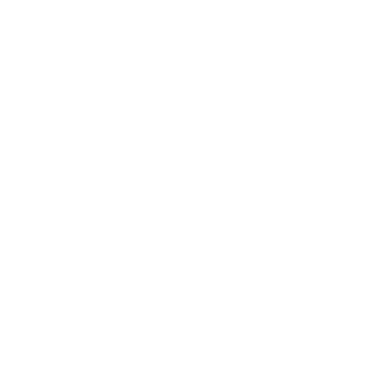

  <picture>
    
  </picture>

  <h1>
    Plugin.Maui.NearbyConnections
  </h1>
  

    A .NET MAUI plugin that faciltates peer-to-peer (P2P) connections between nearby devices by unifying Google's <a href="https://developers.google.com/nearby/connections/overview" target="_blank">Nearby Connections</a> and Apple's <a href="https://developer.apple.com/documentation/multipeerconnectivity" target="_blank">Multipeer Connectivity</a> capabilities.
  

  

    
    
    
  

# Getting Started