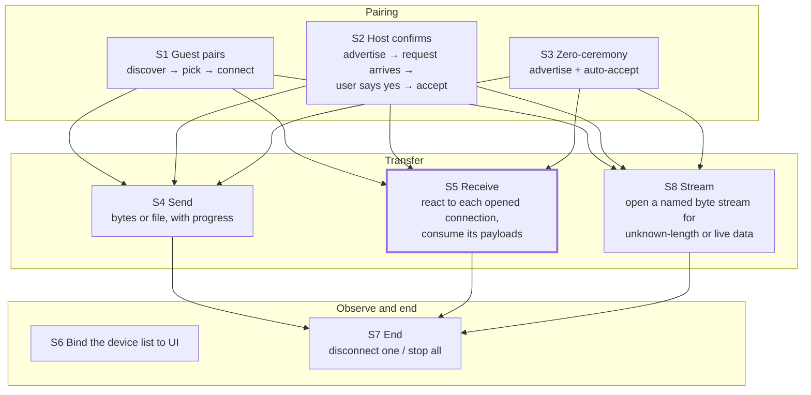
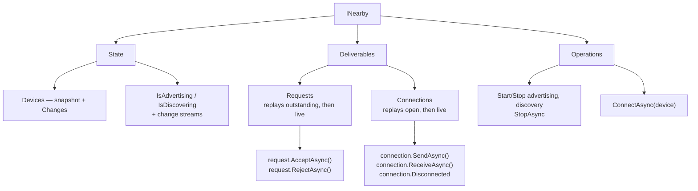
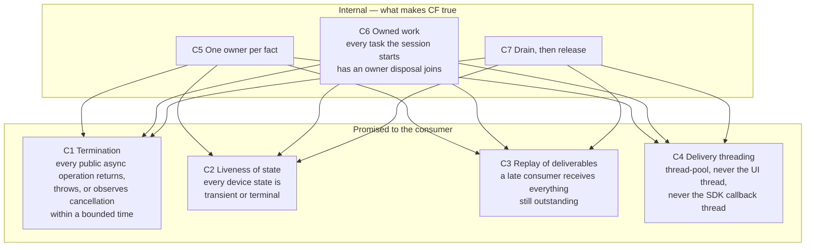
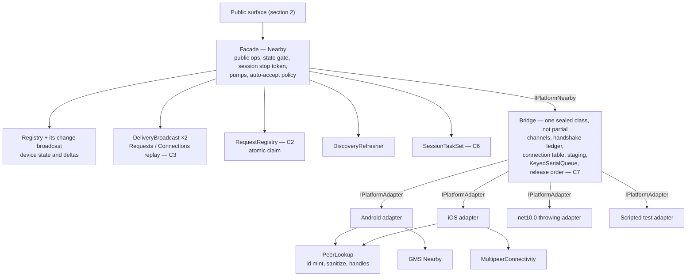
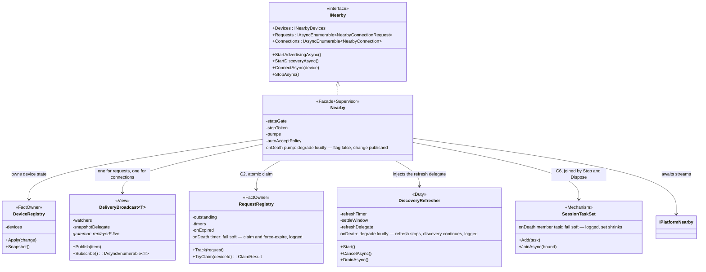
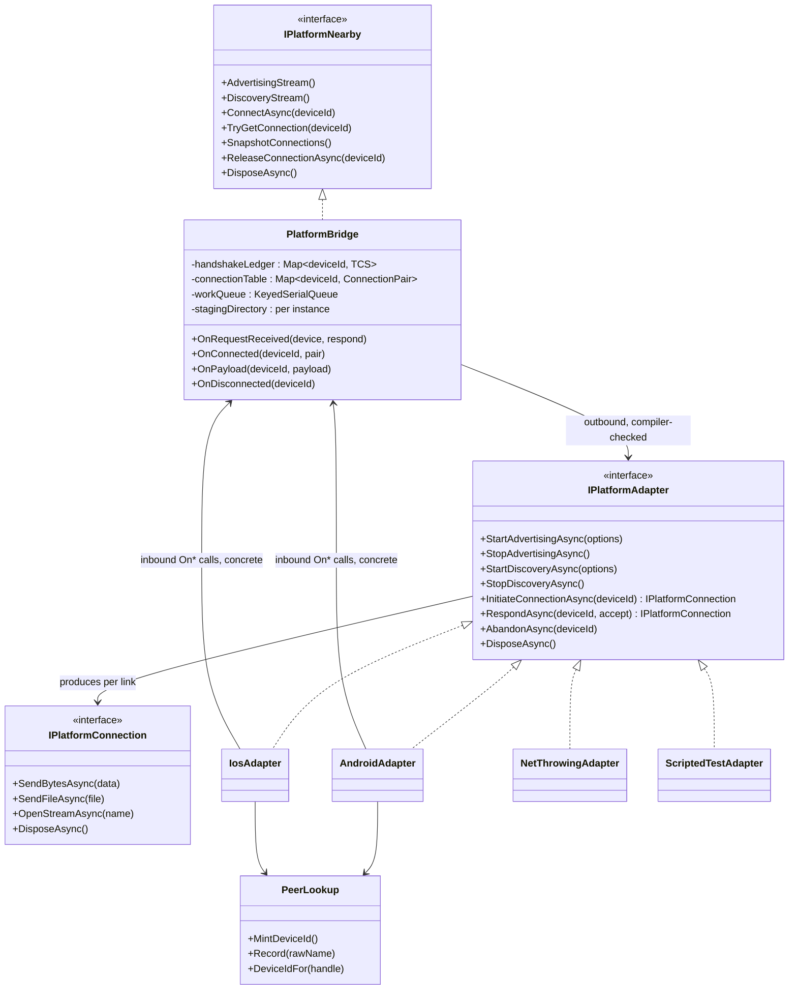
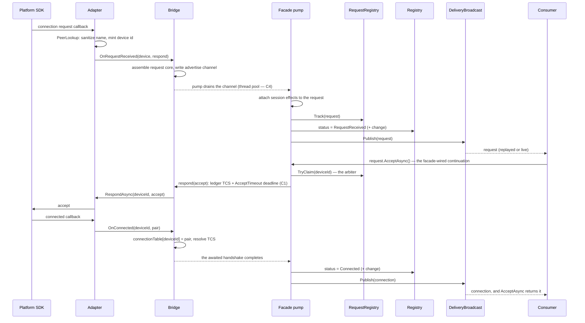
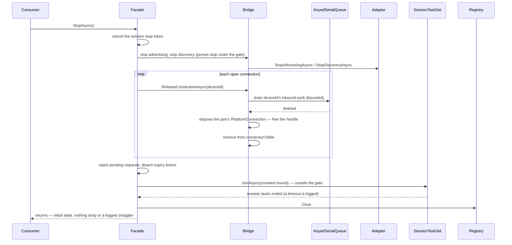
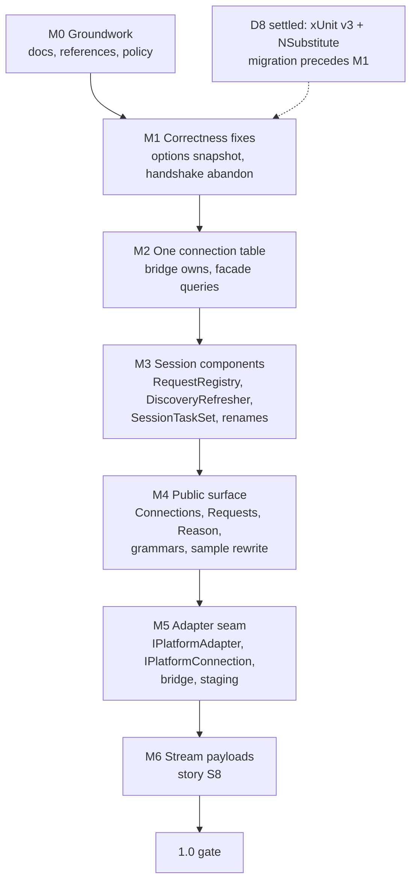

# Architecture

> **Status: approved design, 2026-08-25.** Sections 1–4 state the target architecture, from
> consumer stories down to internal decomposition. Section 5 is the migration work list from
> the as-is code to that target. Implementation follows the section 5 stages, and each stage
> updates this document when it lands.

## Table of contents

- [1. Consumer stories](#1-consumer-stories)
  - [The story map](#the-story-map)
  - [Where each story stands today](#where-each-story-stands-today)
  - [Why S5 fails: the five burdens](#why-s5-fails-the-five-burdens)
  - [The bar](#the-bar)
  - [Stories this library refuses](#stories-this-library-refuses)
  - [Decided for this layer](#decided-for-this-layer)
- [2. Public surface](#2-public-surface)
  - [The doctrine: state and deliverables](#the-doctrine-state-and-deliverables)
  - [The surface map](#the-surface-map)
  - [What changes against today's surface](#what-changes-against-todays-surface)
  - [The stories, re-proven against this surface](#the-stories-re-proven-against-this-surface)
  - [The stream grammars](#the-stream-grammars)
  - [Decided for this layer](#decided-for-this-layer-1)
- [3. Contracts and invariants](#3-contracts-and-invariants)
  - [The contract map](#the-contract-map)
  - [The contracts, with owners and enforcement](#the-contracts-with-owners-and-enforcement)
  - [What changed against today](#what-changed-against-today)
  - [Decided for this layer](#decided-for-this-layer-2)
- [4. Internal decomposition](#4-internal-decomposition)
  - [The target component map](#the-target-component-map)
  - [The layers, and why each boundary sits where it does](#the-layers-and-why-each-boundary-sits-where-it-does)
  - [Component archetypes and names](#component-archetypes-and-names)
  - [Death policies](#death-policies)
  - [Fact ownership (the C5 table)](#fact-ownership-the-c5-table)
  - [What this closes](#what-this-closes)
  - [Decided for this layer](#decided-for-this-layer-3)
  - [The seam in detail](#the-seam-in-detail)
    - [Class view — facade and session components](#class-view--facade-and-session-components)
    - [Class view — bridge and adapters](#class-view--bridge-and-adapters)
    - [Sequence view — inbound request, confirmed by the consumer (story S2)](#sequence-view--inbound-request-confirmed-by-the-consumer-story-s2)
    - [Sequence view — teardown (StopAsync, contracts C6 and C7)](#sequence-view--teardown-stopasync-contracts-c6-and-c7)
    - [Failure interleavings the diagrams do not draw](#failure-interleavings-the-diagrams-do-not-draw)
  - [Prior art: the shapes this design converges on](#prior-art-the-shapes-this-design-converges-on)
  - [Adopted from the survey: the per-connection adapter object](#adopted-from-the-survey-the-per-connection-adapter-object)
  - [Survey learnings: adopted and declined](#survey-learnings-adopted-and-declined)
- [5. Migration map](#5-migration-map)
  - [The rules of the migration](#the-rules-of-the-migration)
  - [The stages](#the-stages)
  - [M0 — Groundwork](#m0--groundwork)
  - [M1 — The two correctness fixes](#m1--the-two-correctness-fixes)
  - [M2 — One owner for the connection table](#m2--one-owner-for-the-connection-table)
  - [M3 — Session components](#m3--session-components)
  - [M4 — The public surface](#m4--the-public-surface)
  - [M5 — The adapter seam](#m5--the-adapter-seam)
  - [M6 — Stream payloads](#m6--stream-payloads)
  - [The 1.0 gate](#the-10-gate)
  - [The decision list, dispositioned](#the-decision-list-dispositioned)
  - [Open items at implementation](#open-items-at-implementation)
  - [Superseded documents](#superseded-documents)
  - [After the gate — the trim](#after-the-gate--the-trim)

## 1. Consumer stories

This library exists to make Android and iOS look like one thing. This section states what
that one thing is *for*. Every later layer is judged against these stories. A design that
makes a story harder fails review, whatever else it improves.

Scope is settled: **transfer and pairing, not background chat**. There is no auto-reconnect,
and there never will be. The stories below all fit inside that scope.

### The story map



### Where each story stands today

| Story | Verdict today | Evidence |
|---|---|---|
| S1 Guest pairs | Passes | `ConnectAsync` returns the connection. The timeout is absorbed on both platforms. Failure is one typed exception family. |
| S2 Host confirms | Mostly passes | The host must *find* the request by pattern-matching status transitions in `Devices.Changes`. The accept call itself is clean. |
| S3 Zero-ceremony | Passes | One option flag. |
| S4 Send | Passes | One awaited call, typed failures, progress via `IProgress<T>`. |
| S5 Receive | **Fails** | The minimal correct consumer is 236 lines (`samples/NearbyChat/Services/NearbyIngestionService.cs`). See the burden list below. |
| S8 Stream | **Missing** | Both SDKs carry byte streams natively — a GMS stream payload, a MultipeerConnectivity named stream. The library drops inbound stream payloads today and offers no way to open one. Added by the domain survey (section 4). |
| S6 Bind to UI | Passes | One `NearbyDeviceCollection<TRow>` constructor. Disposal is the only cleanup. |
| S7 End | Passes | `DisconnectAsync` / `StopAsync`, both bounded. Lifecycle wiring stays the app's decision. |

### Why S5 fails: the five burdens

The surface makes the receiving consumer solve five puzzles the library created:

1. `Devices.Changes` never replays. The watcher must exist before the first connection.
   That forces the `IMauiInitializeService` timing ritual.
2. The stream carries status transitions, not "a connection opened". The consumer keeps a
   dedupe set or processes every payload twice.
3. The connection arrives by a separate, racy `TryGetConnection` lookup after the status is
   observed.
4. `ReceiveAsync` plus `DisconnectedToken` has a tail-payload trap. Passing the token
   discards payloads buffered just before the drop.
5. The dedupe set must be pruned on disconnect.

S5 is the story that earns the right to reshape the public surface in the next layer. A
connection-delivery stream is one candidate answer. The commitment here is to the story,
not to any mechanism.

### The bar

Every story above is correct consumer code in about ten lines, with no timing ritual. A
consumer that starts late loses nothing it needs. This is the acceptance test the public
surface must pass in section 2.

### Stories this library refuses

Refusals are decisions, recorded with the same weight as the served stories:

- **Background operation and auto-reconnect.** Out of scope, settled. The platform tears
  sessions down in the background. The library reports that honestly instead of fighting it.
- **Raw SDK handles.** Never exposed. A consumer that holds an `MCPeerID` breaks the
  `Native/` quarantine and becomes a consumer the MultipeerConnectivity exit will break.
- **One-platform capabilities with no concrete requester.** These wait behind the policy:
  *named platform scopes or nothing, opened on the first concrete request.* Known waiting
  examples: iOS session security identity, invitation context, advertiser info dictionary.

### Decided for this layer

1. **One-to-many send is not a 1.0 story.** Sending to every connected device is three
   consumer lines over the per-connection surface. A broadcast primitive would need
   partial-failure semantics that do not pay for themselves at this scope. Revisit only on
   a concrete consumer request.

## 2. Public surface

This layer designs the surface that makes every section 1 story true. The test is the bar
from section 1: each story in about ten lines, no timing ritual, nothing lost by starting
late.

### The doctrine: state and deliverables

The surface exposes exactly two kinds of thing. Every member belongs to one of them, and
the delivery rules follow from the kind — a consumer who knows the kind knows how to hold
the member.

| Kind | Definition | Delivery rules |
|---|---|---|
| **State** | A fact that is *current* — readable at any time, changing over time | Read the snapshot any time. Watch a broadcast change stream for what happens next. No replay: the snapshot is the catch-up. |
| **Deliverable** | A thing that *arrives* and must be handled — a request, a connection, a payload | Delivered through a stream. Enumeration first yields what is still outstanding, then what arrives next, so a late consumer loses nothing that still matters. |

Today's surface has the state half right (`Devices`, `IsAdvertising`, `IsDiscovering`) and
delivers payloads correctly per connection. Its gap is the middle: requests and connections
*arrive*, but the surface reports them only as status transitions on state. Section 1's
five burdens are all consequences of that one gap — the consumer rebuilds "a connection
arrived" from state deltas by hand.

### The surface map



### What changes against today's surface

**Added: `INearby.Connections`.** A broadcast `IAsyncEnumerable<NearbyConnection>`. Each
enumeration yields every currently open connection first, then each connection as it opens,
each exactly once per enumerator. It is a stream, not a second collection — it holds no
state of its own, so it cannot disagree with `Devices`. It yields the same instance
`ConnectAsync` and `AcceptAsync` return. This closes S5's burdens 1, 2, 3, and 5 in one
member.

**Added: `INearby.Requests`.** The same shape for inbound connection requests: a broadcast
stream of `NearbyConnectionRequest`, replaying outstanding requests, then live ones. The
request object carries `RemoteDevice`, `AcceptAsync`, and `RejectAsync` — the internal
`Connections/NearbyConnectionRequest.cs` already has exactly this shape and becomes public.
Accept and reject move onto the request because that is where the decision is made. This
retires the "device has no outstanding request" `InvalidOperationException` class: a
consumer holding a request cannot name a device that never asked. With
`AutoAcceptConnectionRequests` enabled, `Requests` never yields — the connection arrives
through `Connections` instead.

**Removed: `INearby.AcceptAsync` and `INearby.RejectAsync`.** Subsumed by the request
object. `ConnectAsync(device)` stays on the facade: initiating is device-shaped, not
request-shaped.

**Changed: `NearbyDeviceChange` gains a reason** (decision D1, settled now while it is
cheap). A nullable `Reason` property — init-only, not positional, so adding it breaks no
compiled consumer — carrying why a device left or a connection ended. The internal
`EndReason` case analysis is the starting point for the enum. After 1.0 this shape is
frozen.

**Added: stream payloads (story S8).** Bytes and files cover bounded transfers. A third
payload kind covers unknown-length and live data: `connection.OpenStreamAsync(name)`
returns a writable `System.IO.Stream`, and the remote side receives a
`NearbyStreamPayload` — a readable stream plus its name — through the same `ReceiveAsync`
loop as every other payload. Both SDKs carry this natively: a GMS stream payload on
Android, a named MultipeerConnectivity stream on iOS. MultipeerConnectivity carries the
name and GMS does not, so the library absorbs the difference by sending the name in-band
through its existing control-message codec.

**Changed: `Disconnected` reports why.** `NearbyConnection.Disconnected` completes with
the same locally-observed reason set the change stream carries. This mirrors the
connection-state models in the domain survey — `NWConnection` fails *with* its error — and
saves the consumer a cross-reference against the change stream.

**Kept, deliberately.** `Devices` and its change stream, unchanged — presence is state, and
UI still binds through `NearbyDeviceCollection<TRow>`. `TryGetConnection` stays as the
point lookup for device-shaped call sites (a send button on a device row). The
`ReceiveAsync` cancellation-token contract stays documented rather than absorbed: passing
`Disconnected`'s token discards tail payloads, and hiding that would change cancellation
semantics dishonestly.

### The stories, re-proven against this surface

S5 Receive — the story that failed at 236 lines:

```csharp
// Anywhere, any time — no initializer ritual, nothing missed by starting late.
await foreach (var connection in nearby.Connections.WithCancellation(appToken))
{
    _ = ConsumeAsync(connection);
}

async Task ConsumeAsync(NearbyConnection connection)
{
    await foreach (var payload in connection.ReceiveAsync())
    {
        Handle(payload);
    }
}
```

S2 Host confirms — no more pattern-matching on status transitions:

```csharp
await foreach (var request in nearby.Requests.WithCancellation(pageToken))
{
    if (await ConfirmWithUserAsync(request.RemoteDevice))
    {
        var connection = await request.AcceptAsync();
    }
    else
    {
        await request.RejectAsync();
    }
}
```

S1, S3, S4, S6, and S7 already passed and are untouched by these changes.

### The stream grammars

Each public stream promises its item sequence as a grammar, pinned by a unit test — the
lesson from Rx, whose durable core is its grammar, not its type names. A grammar covers one
stream's shape only. It never promises ordering across streams.

```text
Devices.Changes    := change*            ends only by cancellation
Requests           := replayed* live*    each request exactly once per enumerator
Connections        := replayed* live*    the same instance ConnectAsync / AcceptAsync return
ReceiveAsync       := payload* end       end = disconnect, after the buffered tail
AdvertisingChanges := bool*              the item is the new value (DiscoveryChanges alike)
```

Writing these forced one contract sharp: a `Requests` enumerator may yield a request whose
expiry then wins the race — the grammar's "exactly once" is delivery, not validity, and the
`Expired` task plus the typed exception carry the validity story.

### Decided for this layer

1. **Stale requests: both mechanisms, each solving a different half.**
   `NearbyConnectionRequest` exposes an `Expired` task — the same one-time-completion idiom
   as `NearbyConnection.Disconnected` — so a ViewModel can await it and dismiss its dialog
   as state. No signal beats every race, so `AcceptAsync` and `RejectAsync` on a dead
   request throw a sealed `NearbyRequestExpiredException` as the backstop. The request
   object is a small mirror of the connection object: one operation pair, one lifetime
   signal, one typed failure.
2. **`Reason` carries only locally-observed facts.** All five internal `EndReason` cases
   survive, because each is a fact this library observes itself: `RequestExpired`,
   `RequestRejected`, `Cancelled`, `TimedOut`, `Failed`. Established-connection and
   visibility cases are added only where locally attributable: `DisconnectedByLocal`,
   `SessionStopped`, `LostFromDiscovery`. Neither platform reports *why* an established
   connection dropped, so remote-close and link-loss collapse into one `Disconnected` case
   — splitting them would promise a distinction no platform can keep. Final case names are
   verified against the naming rules at implementation.

## 3. Contracts and invariants

The surface in section 2 is safe only because of promises the members themselves cannot
show. This layer names those promises, states who each one is made to, and fixes how each
one is enforced. A contract without an enforcement form is a defect in this document.

### The contract map



### The contracts, with owners and enforcement

| # | Contract | Promised to | Enforcement in the target |
|---|---|---|---|
| C1 | Every public async operation terminates within a bounded time, on both platforms, whatever the radio does. `Timeout.InfiniteTimeSpan` opts out by the consumer's own choice. | Consumer | One shared await helper owns every platform-callback deadline. The rule stays: a new await on a platform callback goes through that helper or documents its own deadline. Device tests exercise each deadline path. |
| C2 | No device sits forever in a state it cannot leave. `RequestReceived` is bounded by `InboundRequestTimeout`. | Consumer | The request-expiry component (section 4) owns the timer. Device tests assert the transition. |
| C3 | *(new, from section 2)* Enumerating `Requests` or `Connections` first yields everything still outstanding, exactly once per enumerator, then live arrivals. Starting late loses nothing that still matters. | Consumer | Unit tests over the delivery seam. The replay set is naturally bounded — a radio holds only a handful of open connections and pending requests — so no buffer policy is needed. |
| C4 | Changes and deliverables arrive on thread-pool threads. Nothing in the library has UI thread affinity except `NearbyDeviceCollection<TRow>`. No channel allows synchronous continuations, so a slow consumer cannot stall SDK callback dispatch. | Consumer | Channel construction sites are the enforcement point, as today. Not configurable, deliberately. |
| C5 | Every state fact has exactly one owning component. Every other holder is a reader or a derived view. | Contributors | Section 4 names the owner of each fact in its component table. A change that gives a fact a second writer fails review against that table. |
| C6 | No fire-and-forget without an owner. Every task the session starts is joined by disposal within a constant bound: session-scoped tasks through a bounded-join set, platform-callback work through `KeyedSerialQueue`. | Contributors | The two owning types. A bare `_ =` discard of live work outside them is the review flag. |
| C7 | Teardown waits for the work that reads a handle before freeing the handle, at every scope, with every drain bounded by a constant. Cancellation is not a join. | Contributors | Prose, owned by this document, listing the drain sites once section 4 fixes their number. Revisit as a type only if the sites multiply. |

### What changed against today

- **C3 is new.** It is the contract form of section 2's deliverable doctrine, and it
  replaces the documentation burden that told every consumer to start watching before
  connecting.
- **C6 gains its missing half.** Platform-side work already has an owner
  (`KeyedSerialQueue`). Session-side tasks (auto-accept, disconnect watching, request
  expiry) get a bounded-join set, so disposal can finally say what it may assume.
- **C1, C2, C4, C7 are today's guarantees restated.** They hold in the current code and
  survive unchanged. The target redistributes who implements them, not what they promise.
- **This document becomes the contracts' home.** `docs/CONCURRENCY.md` is referenced from
  the codebase but does not exist. It is not restored. The references move here, to this
  section, in the migration (section 5).

### Decided for this layer

1. **`StopAsync` joins C6's bounded-join set, not only `DisposeAsync`.** Stop promises a
   return to the initial state. A stray auto-accept task surviving a stop could write into
   the next session's registry, which would make that promise false. Stop therefore joins
   the set with the same constant bound disposal uses.

## 4. Internal decomposition

This layer gives every responsibility a named home, so that new work lands in a component
instead of growing the two largest classes. The shape is judged by the contracts: each
section 3 contract must name the component that enforces it, and each state fact must name
its one owner (C5).

### The target component map



The arrows state the dependency rule: the bridge never calls a session component. Its only
upward path is its channels, which the facade's pumps drain on thread-pool threads. That rule
is what makes C4 true, and it is what keeps `Native/` free of session references at the
MultipeerConnectivity exit.

The inbound path is one named pipeline — **adapter → channel → pump → owner → broadcast** —
and device ids, not objects, are the routing key between its stages. Both are client-go's
lessons: its `Reflector → DeltaFIFO → Indexer → workqueue` chain stays readable a decade on
because the stages are named, and its queues carry keys because objects change while keys
stay stable. The two sequence views below each walk this pipeline end to end.

### The layers, and why each boundary sits where it does

**Facade — the `Nearby` class** (renamed from `NearbyImplementation` in stage M3; the reasoning
is under *Component archetypes and names* below). Keeps only its one reason to change: how public
operations map onto platform
streams. The pump machine and the eight-line auto-accept policy stay inline — extracting
them would create components with no independent reason to change. Everything else moves
out. Auto-accept's contract is explicit: the policy never calls `Track`, never publishes to
`Requests`, and is bounded by `AcceptTimeout` (C1) rather than `InboundRequestTimeout` (C2) —
there is no consumer decision window to bound. Each auto-accept task registers in
`SessionTaskSet` and runs on the facade's session stop token, which `StopAsync` and
`DisposeAsync` both cancel. All registry mutation and all delivery publication happen in the
facade — the components below act through delegates the facade injects.

**Session components, constructed by the facade.** Each owns its state, its timer, and its
failure modes, and each is testable alone on `net10.0`:

- `RequestRegistry` — owns "an inbound request is outstanding for X", its expiry timer,
  and the atomic claim that settles accept, reject, and expiry. `Track(request)` records the
  fact. `TryClaim(deviceId)` resolves it, and exactly one caller wins: a winning accept or
  reject proceeds, a losing one throws `NearbyRequestExpiredException`, and a losing expiry
  timer returns without effect. Expiry effects — the reject, the `Expired` completion, the
  registry transition, the change publish — run inside an `onExpired` delegate the facade
  injects, so device-state mutation keeps one path. The component is constructed with the
  options snapshot, the `TimeProvider`, and that delegate. The C2 enforcement point.
- `DiscoveryRefresher` — owns the refresh interval, the settle window, and eviction.
  Exposes `Start()`, `CancelAsync()`, and `DrainAsync()`. The facade injects one refresh
  delegate that stops and restarts the discover pump under the facade's state gate — the gate
  never leaves the facade. Eviction goes through the registry's own generation API.
- `SessionTaskSet` — the bounded-join set from C6. Tasks self-remove on completion. `Add`
  during a join is accepted, and `JoinAsync(bound)` loops until the set is quiet or the bound
  elapses. A join timeout is logged. `StopAsync` and `DisposeAsync` both join it, after
  connection disposal and before the registry clear, outside the state gate.
- `DeliveryBroadcast<T>` — the C3 seam: broadcast streams for `Requests` and `Connections`
  that replay what is still outstanding, then live arrivals. Same watcher pattern as
  `ChangeBroadcast`, plus the handover rule below. It holds no fact state — only a
  per-enumerator handover guard. Each instance is constructed with a snapshot delegate: the
  request registry's outstanding set for requests, `IPlatformNearby.SnapshotConnections()`
  for connections.
- `DeviceRegistry` (renamed from `NearbyDeviceRegistry` in stage M3) and `ChangeBroadcast` —
  behaviorally unchanged. They are the proof extraction works: both are recent extractions and both are
  the best-bounded components in the tree.

**The handover rule (C3).** At enumeration start the delivery enumerator subscribes first,
then reads the snapshot through its delegate, yields the snapshot, then yields live items and
suppresses any live item that is reference-equal to a snapshot member. The guard set is
bounded by the snapshot size and dies with the enumerator. Either other order fails C3: read
first and an item that arrives in the window is yielded zero times, subscribe first without
the guard and it is yielded twice.

**Bridge.** One sealed, non-partial class behind `IPlatformNearby`. It owns everything both
platforms share: the channels, the handshake ledger, the connection table, instance-scoped
file staging, `KeyedSerialQueue`, and the drain-then-release order (C7). The connection table
maps `deviceId` to the pair (`NearbyConnection`, `IPlatformConnection`) — one entry per link,
public object and platform object together, so release disposes both in order. The six
behaviors that today exist twice and are kept aligned by comments — lost-device suppression,
found-device handling, terminal catch ladders, terminal progress reports, unobserved-fault
retirement, connection assembly — are written once here, above the adapters. Connection
assembly is two-stage: the bridge builds the platform core (receive channel, respond and
dispose wiring), and the facade attaches the session effects (registry transition, delivery
publish, disconnect watcher) when its pump drains the item.

**Adapters.** One internal interface, `IPlatformAdapter`, whose members are today's
`Platform*` partial-method list — a contract that already exists in effect and has been
stable. Four implementations: Android, iOS, a throwing `net10.0` adapter, and a scripted
test adapter. The inbound direction stays concrete: adapters call the bridge's internal
methods. The SDK-typed entry points the device tests drive keep their signatures and relocate
into the adapter types, so the device suite constructs an adapter-bridge pair and asserts the
same channel, ledger, and registry effects. `PeerLookup` keeps its partial split — its
per-platform halves are small and have never slipped. Its shared half mints device ids, which
is what the scripted adapter uses on `net10.0`.

**Stream-name carriage (story S8).** Each adapter owns how a stream's name travels: an
in-band frame on Android, the native carrier on iOS. The bridge owns the platform-neutral
contract — an inbound stream arrives as a name-and-stream pair, assembled into
`NearbyStreamPayload` and delivered through the connection's receive channel. The in-band
frame format is a wire contract between peers of different plugin versions and is settled
before S8 ships (section 5, stage M6).

### Component archetypes and names

Four archetypes cover every session component. Each archetype has one naming form, and the
name answers the reader's first question: does this thing own a fact?

| Archetype | Owns a fact? | Naming form | Members |
|---|---|---|---|
| **Fact owner** | Yes — holds it, serializes it, bounds its liveness | `<Fact>Registry` | `DeviceRegistry` · `RequestRegistry` |
| **View** | No — fans a fact out, dies with its enumerators | `<Kind>Broadcast` | `ChangeBroadcast` · `DeliveryBroadcast<T>` |
| **Duty** | No — runs one recurring responsibility | agent noun | `DiscoveryRefresher` |
| **Mechanism** | No — reusable structure, no domain knowledge | structural noun | `KeyedSerialQueue` · `SessionTaskSet` |

Renames this settles: `RequestExpiryTracker` → `RequestRegistry` (the name follows the
fact, not the timer — expiry is the liveness duty every fact owner carries),
`DiscoveryRefreshLoop` → `DiscoveryRefresher` (the duty survives if the loop becomes a
timer callback), `NearbyImplementation` → `Nearby` (the standard `IFoo`/`Foo` pair —
"Implementation" names nothing), `PlatformNearby` → `PlatformBridge`, and
`NearbyDeviceRegistry` → `DeviceRegistry` (the `Nearby` prefix is collision armor for
*public* types in a MAUI app — internal types do not wear it, and every other internal
component is already bare). `PeerLookup` is
the one grandfathered exception: by the scheme it is a fact owner, but it sits in
`Native/`, has never slipped, and renaming it buys the least. Internal names never appear
in the PublicAPI baselines, so these renames have zero consumer impact. Prior art:
Kubernetes client internals name by role (`Reflector`, `Informer`, `Indexer`) and stay
readable; Rx names by mechanism and needs a decoder ring.

### Death policies

Every long-lived component declares what its failure means, from a closed set — the
supervision lesson from Erlang/OTP, without the supervision machinery. No policy is
*restart* in 1.0: restarting against shared state has no failing test behind it. The set:

- **Degrade loudly** — stop, flip the observable state, report on the change stream.
- **Fail soft** — absorb the failure, log it, continue.

| Component | On death |
|---|---|
| A pump (in `Nearby`) | Degrade loudly: the flag goes `false`, the change stream reports it |
| `DiscoveryRefresher` | Degrade loudly: refreshing stops, discovery itself continues, logged |
| A `RequestRegistry` timer | Fail soft: claim and force-expire the request, logged |
| A `SessionTaskSet` member | Fail soft: logged, the set shrinks |
| Bridge and adapter callbacks | Fail soft: absorb, log — see *Failure interleavings* |

The repo's gold standard already exists — the iOS backgrounding teardown fails loudly:
flags observably `false`, devices observably changed. These policies make that standard
total, and each policy line is testable.

### Fact ownership (the C5 table)

Every fact has one owning component that holds and serializes it. Mutators route through the
owner's API. Everyone else reads or derives. Serialization by ownership takes exactly two
sanctioned forms in this design — *lock-owned* (the registry's lock) and *lane-owned*
(`KeyedSerialQueue`'s per-key lanes), the structural single-writer lesson from Netty's
channel-pinned event loops. A mutation path that uses neither form fails review.

| Fact | Owner | Everyone else |
|---|---|---|
| Device presence, status, and the device change stream | Registry, its broadcast included | The facade and its injected delegates mutate through the registry's API. UI reads snapshots and deltas. |
| "Device X has a live connection" | Bridge connection table — `deviceId` → (`NearbyConnection`, `IPlatformConnection`) | Facade queries `TryGetConnection` and reads `SnapshotConnections()` through `IPlatformNearby`. `NearbyDevice.Status == Connected` is a derived view. `Disconnected` is a derived signal. |
| "Advertising / discovery started" | Bridge — `Step` resolves or faults it, on both branches | Facade pumps await it. The pump faults it only when the pump itself fails before `Step` runs — the one documented backstop, harmless late writes absorbed by `TrySet*`. |
| "Inbound request outstanding for X" | `RequestRegistry` — the atomic claim settles accept, reject, or expiry, and exactly one wins | Handshake ledger holds only the accept-in-progress TCS. Registry status is a derived view. Auto-accept never creates the fact. |
| Live session tasks (auto-accept, disconnect watchers) | `SessionTaskSet` | `StopAsync` and `DisposeAsync` join it. A bare task discard outside the two owning types fails review (C6). |
| Peer identity and platform handles | `PeerLookup` | Nothing above `Native/` sees a platform identifier. The shared half mints ids for the scripted adapter too. |
| Inbound file staging path | Bridge, per instance | No process-wide static remains |
| How a stream's name travels | The platform adapter — in-band frame on Android, native carrier on iOS | The bridge sees only name-and-stream pairs. The frame layout is a wire contract, settled pre-S8. |
| Configured options | Immutable snapshot captured at registration | Everyone reads the snapshot |

The delivery streams own no fact. A `DeliveryBroadcast<T>` enumerator holds only its handover
guard, and the guard dies with the enumerator.

### What this closes

- The connection-table split and its stale-read window: one table, emptied inside release,
  before disposal returns.
- The accept-versus-expiry race: one atomic claim, so a consumer can never observe both a
  connection and an expired request.
- The replay window: the handover rule makes C3's "exactly once per enumerator" a mechanism,
  not an aspiration.
- The stray-task write into a next session: teardown cancels, joins, and only then clears,
  and a join timeout is logged instead of silent.
- The sibling-parity defect class: the six duplicated behaviors have one home, so there is
  no sibling to forget.
- The `net10.0` test gap: the scripted adapter lets unit tests drive the bridge's channel
  swap, ledger, and release logic off-device, while the shipping stub keeps throwing.
- The MultipeerConnectivity exit: the migration to Network.framework becomes one new
  adapter written against a compiler-checked contract. No shared invariant is in reach of
  the migration's diff.

### Decided for this layer

1. **The adapter seam is adopted (decision D5).** The cost is churn concentrated in the two
   largest files, one new internal interface, and roughly five new types against the unnamed
   clusters they retire: request expiry, discovery refresh, session-task ownership, delivery
   replay, the six per-platform duplications of shared behavior, and the `net10.0` stub. The
   migration is incremental — interface first, per-platform adapter extraction second, shared
   hoists one behavior per commit, entry-point relocation, then the partial collapse — and
   every intermediate commit builds all three TFMs. The sibling-parity closure, the scripted
   adapter, and the bounded MultipeerConnectivity exit all depend on the seam, and together
   they pay for it.
2. **The handover rule is the C3 mechanism.** Subscribe, snapshot, dedupe by reference, then
   live. Decided here because both alternative orders fail C3.
3. **One atomic claim settles accept, reject, and expiry.** The claim lives in
   `RequestRegistry` and runs at operation entry, not at the connected callback.
4. **Teardown order is fixed:** cancel the session stop token, stop the pumps under the gate,
   dispose connections, reject pending requests, join the task set outside the gate, clear
   the registry, return. A join timeout is logged.
5. **The bridge never calls a session component.** The channels are the only upward path.
   This is the C4 enforcement and the migration boundary in one rule.
6. **The systems-survey increments are adopted, and none adds a component:** a death
   policy per long-lived component (degrade loudly or fail soft — no restarts in 1.0), the
   two sanctioned single-writer forms in the C5 table, one grammar line per public stream
   in section 2 with a pinning test each, the named inbound pipeline, and the archetype
   naming scheme with its five renames.

### The seam in detail

Three views of the same proposal, for review. Class views show who holds whom. Sequence
views show the two flows that cross every boundary: an inbound request accepted by the
consumer, and session teardown. A third inset covers the interleavings the diagrams do not
draw.

#### Class view — facade and session components



`DeliveryBroadcast<T>` holds no fact state. At enumeration start it subscribes, reads the
current outstanding set through its snapshot delegate (`RequestRegistry` for requests,
`SnapshotConnections()` for connections), yields it, then yields live arrivals with the
handover guard suppressing the one possible duplicate. One fact, one owner, two views — C5
holds, and C3's "exactly once" holds with it.

#### Class view — bridge and adapters



`ConnectionPair` is the tuple (`NearbyConnection`, `IPlatformConnection`) — the table's one
entry per link. The relationship between bridge and adapter is deliberately asymmetric.
Outbound (bridge → adapter) is the interface: that is the direction a new backend implements,
and the compiler checks it. Inbound (adapter → bridge) stays concrete `On*` methods: that is
the surface the device tests drive, and a second interface there would have one caller per
direction and no second implementation — it would fail the interface-first bar the outbound
interface passes. The SDK-typed entry points live in the adapters with today's signatures.
The `net10.0` adapter throws from every start and never produces a connection. The scripted
adapter is the off-device implementation, and it is what makes the bridge's channel swap,
ledger arbitration, and release order testable from the unit suite.

#### Sequence view — inbound request, confirmed by the consumer (story S2)



If the SDK never sends the connected callback, the `AcceptTimeout` deadline faults the
ledger TCS and `AcceptAsync` throws — contract C1. If the consumer never answers, the
request registry's timer claims the fact at `InboundRequestTimeout`, and the facade's
`onExpired` delegate rejects the request, completes `Expired`, and reports `RequestExpired`
on the change stream — contract C2. If accept and expiry race, `TryClaim` picks exactly one
winner: a losing accept throws `NearbyRequestExpiredException`, and a losing timer does
nothing. With auto-accept enabled, none of the request-registry or `Requests` steps occur —
the facade accepts directly, the task is owned by `SessionTaskSet`, and the connection
arrives through `Connections`.

#### Sequence view — teardown (StopAsync, contracts C6 and C7)



The order is the guarantee. Cancellation comes first, so the join is normally immediate and
the bound is the backstop, not the plan. Connection disposal precedes the join, because the
disconnect watchers finish only when `Disconnected` resolves. The join precedes the registry
clear, so a straggler's last transition lands before the clear instead of resurrecting a row
after it. Drain precedes release at every scope: an inbound file copy still writing is
joined before the handle it writes to is freed. The table empties inside release, before
stop returns, which is what closes the stale-`TryGetConnection` window.

#### Failure interleavings the diagrams do not draw

- **A platform callback during teardown.** The bridge fails soft: a settled or cleared
  ledger entry absorbs `TrySet*`, and a payload for a released connection logs and drops.
  No callback reaches a freed handle, because release drained that peer's work first (C7).
- **A delivery enumeration racing disposal.** The enumerator unsubscribes in its own
  `DisposeAsync`, on the read path and the never-read path alike — the same discipline
  `ChangeBroadcast` already enforces.
- **Accept racing expiry.** Settled by the atomic claim — drawn in the S2 gloss above.

### Prior art: the shapes this design converges on

The section 2 surface and the section 4 seam were derived from this library's own stories
and contracts. Surveying the wider domain shows they converge on shapes that networking
APIs keep arriving at independently. That convergence is evidence the shapes are right,
and it names the models to consolidate toward.

| This design | Established model | Where it appears |
|---|---|---|
| `Devices` snapshot + `Changes` deltas | Browse-results set with change deltas | `NWBrowser.browseResultsChangedHandler` delivers `(results, changes)` — the current set and the delta, exactly this split. Kubernetes list-then-watch informers. DNS-SD browsing. |
| `Connections` stream | The accept loop | BSD `listen`/`accept`. `TcpListener` and `QuicListener.AcceptConnectionAsync`. ASP.NET Core's `IConnectionListener.AcceptAsync` yielding `ConnectionContext`. `NWListener` handing an `NWConnection` per accepted client. |
| `Requests` with accept/reject and expiry | Application-layer admission | WebRTC's offer/answer consent. Bluetooth pairing confirmation. The MultipeerConnectivity invitation handler. Transport-level listeners auto-accept; proximity APIs put a human in the loop, so the request is first-class here. |
| `NearbyConnection` — duplex ops, lifetime signal, typed payloads | The connection object | `NWConnection`, `ConnectionContext`, `QuicConnection`, WebRTC's `DataChannel`: send, receive, a state/closed signal, dispose. |
| Replay-then-live deliverables (C3) | List-then-watch | Kubernetes informers: list the current state, then watch from that point, missing nothing. |
| `IPlatformAdapter` | The transport abstraction | Kestrel's transport layer (`IConnectionListenerFactory`). libp2p transports. One connection model, N transports below it. |
| Minted `NearbyDevice.Id` | Library-owned peer identity | libp2p's `PeerId`: identity lives above the transport, never borrowed from it. |

Two deliberate departures, kept: no byte-stream or pipe surface (`IDuplexPipe`), because
both SDKs and both stories are message-and-file shaped, not stream shaped. And no
listener/browser role split on the public facade — one `INearby` — because the stories mix
roles freely and a MAUI app resolves one singleton.

### Adopted from the survey: the per-connection adapter object

Every model in the table splits transport work the same way: a *listener/session* object
for discovery and admission, and a *connection* object per established link. A flat adapter
keyed by `deviceId` forces every adapter to re-look-up its native handle on every send.

The adopted shape: the adapter's connection-scoped members live on an adapter-produced
`IPlatformConnection`, exactly as drawn in the class view above.

What it buys:

- The `deviceId`-keyed dispatch inside each adapter disappears. The native handle is
  captured once, at establishment, where it is known.
- Drain-then-release (C7) becomes local: the bridge drains, then disposes *this*
  connection object. `IPlatformNearby.ReleaseConnectionAsync(deviceId)` remains the
  facade's device-shaped entry point, and inside the bridge it resolves to the pair and
  disposes locally.
- The MultipeerConnectivity exit gets cheaper again: a Network.framework adapter wraps
  `NWConnection` in `IPlatformConnection` almost one-to-one.

Cost: one more internal interface, and the bridge's table maps `deviceId` to the pair
(`NearbyConnection`, `IPlatformConnection`) — the `ConnectionPair` in the class view.
`OpenStreamAsync` lives here too: the per-connection object is what makes stream payloads
(story S8) a natural fit — `QuicConnection` and `NWConnection` open their streams from the
connection object for the same reason.

### Survey learnings: adopted and declined

Every learning the survey produced, dispositioned. Declined learnings are recorded so the
next reviewer does not rediscover them.

| Learning | Source model | Disposition |
|---|---|---|
| Sub-streams within a connection | QUIC and libp2p stream muxing, MultipeerConnectivity named streams, GMS stream payloads | **Adopted** as one-way named byte streams — story S8, surfaced in section 2. The name's carriage is adapter-owned — see the C5 table. |
| Connection failure carries its reason | `NWConnection` `failed(error)`, `ConnectionContext` abort reason | **Adopted**: `Disconnected` completes with the locally-observed reason — section 2. |
| Session/connection split in the transport layer | `NWListener`/`NWConnection`, Kestrel listener/`ConnectionContext` | **Adopted** as `IPlatformAdapter` / `IPlatformConnection`, above. |
| Byte-pipe receive surface with backpressure | `IDuplexPipe`, `PipeReader` | **Declined.** Both SDKs push payloads regardless of consumer readiness, so a pipe would present backpressure the library cannot exert on the radio. Delivery-first design (C3) is the honest fix for unconsumed buffering. |
| Typed feature collections as the escape hatch | `ConnectionContext.Features` | **Declined** in favor of named platform scopes. A feature bag hides platform divergence at the call site — the first principle wants it visible. |
| In-band goodbye frame to attribute remote close | Application-level protocols | **Declined.** Only plugin-to-plugin peers would send it, so the reason would lie whenever the remote peer is not this library. Remote close stays collapsed into `Disconnected`. |
| Declared failure policy per worker | Erlang/OTP supervision trees | **Adopted** as the death-policy table — degrade loudly or fail soft, no restarts in 1.0. |
| Serialization by ownership, structurally | Netty's channel-pinned event loops | **Adopted as principle**: the C5 table names the two sanctioned single-writer forms, lock-owned and lane-owned. No restructuring — the registry's lock is already correct. |
| A formal per-stream grammar | Rx's `OnNext* (OnError\|OnCompleted)?` | **Adopted**: one grammar line per public stream (section 2), each pinned by a test. |
| Named pipeline stages, keys flowing between them | client-go's `Reflector → DeltaFIFO → Indexer → workqueue` | **Adopted**: the inbound pipeline is named, and device ids — not objects — are the routing key. |

## 5. Migration map

This section is the work list. It sequences the path from today's code to the shape sections
1–4 fixed, dispositions every decision the 2026-08-25 re-assessment raised, and absorbs what
is still live from the five root-level review documents — which it then supersedes. When a
stage lands, its entry here gains a done mark and a commit reference. This resolves decision
D9: findings live here, not in a floating review document and not in closed GitHub issues.

### The rules of the migration

- **Every stage ends green.** All three TFMs build warning-free, and the unit suite passes
  via `dotnet run`. A stage that touches a platform partial runs that platform's device
  suite.
- **Every public-surface stage leaves the three PublicAPI baselines byte-identical** and
  passes the naming checks in `.claude/rules/naming.md` section 10.
- **`AGENTS.md` is updated in the same commit as the change it describes.** It documents the
  as-is, so it must never describe a shape that no longer exists.
- **A stage is one reviewable unit.** Stages may span several commits, but no commit leaves
  the build depending on a later stage.

### The stages



The order preserves the re-assessment's reasoning: correctness before restructure (M1 decides
what table removal means on failure paths, so it precedes M2), and the small extractions
before the seam (M2–M3 shrink what M5 moves). M4 sits between them because its two streams
need M3's components — `Requests` replays from `RequestRegistry`, `Connections` snapshots
through the connection table M2 unified — and because landing the surface early lets the
sample and README teach the final shape for the longest time before 1.0. M6 is additive and
may ship in 1.0 or the first minor after — its wire contract is settled before it ships
either way.

### M0 — Groundwork — done (2026-08-25, commit `6a5b524`)

No behavior changes. This stage gives every later stage a place to be tracked and makes every
written contract resolvable. *(Re-assessment fix 1.)*

- Repair the dangling references. `AGENTS.md` and `Native/KeyedSerialQueue.cs` cite
  `docs/CONCURRENCY.md`, which does not exist — both now cite this document, section 3
  (contracts C6 and C7) and section 4 (the teardown order). The unit test
  `NearbyImplementationTests.cs` cites `docs/DECISIONS.md` — it now cites this section.
  `DESIGN-PRINCIPLES.md` and `docs/DEVICE-LIFECYCLE.md` cite
  `docs/PLATFORM-ABSTRACTION-REVIEW.md` — both now cite this section, per D9.
- Record the escape-hatch policy (D4) in `DESIGN-PRINCIPLES.md` as written policy: *named
  platform scopes or nothing, opened on the first concrete request.* A raw-handle hatch stays
  refused.
- The five superseded root-level documents listed under *Superseded documents* below stay at
  the repo root, untracked, while the stages land — they are the evidence base the stages
  cite. They are deleted in the post-gate trim, not here.

### M1 — The two correctness fixes — done (2026-08-25, commits `54306aa`, `a596fe8`)

- **Snapshot the options at registration** (D7, re-assessment fix 2). `AddNearby` validates,
  then captures an immutable copy. One owner for the configuration fact — the C5 table's last
  row becomes true, and the public doc sentence that already promises it stops lying.
- **Abandon on every failed handshake exit** (re-assessment fix 3). The catch-all exit of
  `AwaitHandshakeAsync` runs the same abandon-and-release the deadline exit runs, with the
  device test that proves it. This is the one candidate correctness defect in the as-is code,
  and it lands before M2 because it defines what "remove from the table" means on a failure
  path.

### M2 — One owner for the connection table — done (2026-08-25, commit `2ed24fa`)

The bridge owns the table, the facade queries it (D6, re-assessment fix 4). The facade's
`_activeConnections` is deleted. `TryGetConnection`, `SnapshotConnections()`, and the
`StopAsync` enumeration go through `IPlatformNearby`. The table empties inside
`ReleaseConnectionAsync`, before disposal returns, which closes the stale-`TryGetConnection`
window. The disconnect watcher keeps only its registry transition.

### M3 — Session components — done (2026-08-25, commits `a86c067`, `ee2da87`, `ff083ee`, `b7425fb`)

The facade sheds everything that is not its one reason to change. *(Re-assessment fix 5 plus
section 3's decided item.)*

- Extract `RequestRegistry` — born under its target name, with the atomic claim
  (`TryClaim`), the expiry timer, and the `onExpired` delegate from section 4. The expiry
  logic that lives inline in the facade today moves here.
- Extract `DiscoveryRefresher` — born under its target name, with `Start()`, `CancelAsync()`,
  `DrainAsync()`, and the injected refresh delegate.
- Add `SessionTaskSet`, and route every session-owned task through it. `StopAsync` and
  `DisposeAsync` both join it — C6 gains its missing half.
- Fix the teardown order as section 4 states it: cancel, stop pumps, dispose connections,
  reject requests, join, clear.
- Rename `NearbyDeviceRegistry` → `DeviceRegistry` and `NearbyImplementation` → `Nearby`.
  Internal renames, zero PublicAPI impact.

### M4 — The public surface — done (2026-08-25, commits `82d640e`, `1735720`, `cab74ce`, `76e02c2`)

Section 2 lands whole, because its pieces prove each other. *(Settles D1 and D3.)*

- Add `DeliveryBroadcast<T>` with the handover rule, and expose `INearby.Connections` and
  `INearby.Requests`.
- Make `NearbyConnectionRequest` public: `RemoteDevice`, `AcceptAsync`, `RejectAsync`, the
  `Expired` task, and the sealed `NearbyRequestExpiredException`.
- Remove `INearby.AcceptAsync` and `INearby.RejectAsync`.
- Add `NearbyDeviceChange.Reason` (nullable, init-only) and complete `Disconnected` with the
  same reason set. Final case names are checked against the naming rules here (open item 4).
- Pin the five stream grammars from section 2 with one unit test each.
- Update all three PublicAPI baselines — byte-identical — and re-run the naming checks.
- Rewrite the sample: `NearbyIngestionService` (236 lines) becomes the section 2 loop, the
  initializer-service ritual is deleted, and the README teaches the new shape.

### M5 — The adapter seam

The largest change, after the extractions shrank it (D5, re-assessment fix 7, adopted in
section 4). The internal sub-sequence, each step green on all three TFMs:

1. Declare `IPlatformAdapter` and `IPlatformConnection`.
2. Extract the Android and iOS adapters behind them, one platform at a time.
3. Hoist the six duplicated behaviors into the bridge, one behavior per commit.
4. Relocate the SDK-typed device-test entry points into the adapters — the device suite then
   constructs an adapter-bridge pair and asserts the same channel, ledger, and registry
   effects.
5. Collapse the `PlatformNearby` partials into one sealed `PlatformBridge` (the rename lands
   with the collapse), add the throwing `net10.0` adapter and the scripted test adapter, and
   delete `PlatformNearby.net.cs`.
6. Instance-scope the staging path and the payload counter (re-assessment fix 6) — the last
   process-wide mutable fact.

`PeerLookup` keeps its name and its partial split. After this stage, the
MultipeerConnectivity exit is one new adapter against a compiler-checked contract.

### M6 — Stream payloads

Story S8. `OpenStreamAsync(name)` on the connection and on `IPlatformConnection`,
`NearbyStreamPayload` through `ReceiveAsync`, the name carried in-band on Android and
natively on iOS. Additive to the surface, so it may land after the 1.0 tag without breaking
anything. Two decisions settled 2026-08-25:

- **The in-band frame is accepted as a cross-version wire contract.** That the Android frame
  binds peers across plugin versions is acceptable for now. The frame format itself is
  defined when this stage starts.
- **Teardown is minimal viable.** The consumer owns an open `System.IO.Stream`, so the
  library bounds only teardown's drain — `TransferInactivityTimeout` does not apply to S8
  streams. Richer stream lifecycle handling is deliberately deferred and revisited after M6
  ships.

### The 1.0 gate

The tag is cut only when every check below passes. These are the acceptance criteria the
whole document was built against.

- Every section 1 story is correct consumer code in about ten lines, with no timing ritual.
  The section 2 snippets compile and run as written.
- Every fact in the C5 table has exactly one owner in the code, verified against the table.
- All three PublicAPI baselines are byte-identical, and every naming check in
  `.claude/rules/naming.md` section 10 returns clean.
- The five grammar tests pass, one per public stream.
- No document or code comment references a file that does not exist.
- The MultipeerConnectivity exit is demonstrably one adapter: nothing in `Native/` outside
  the iOS adapter names an MPC type.

### The decision list, dispositioned

The re-assessment's eleven decisions, each settled by an earlier section, slotted into a
stage, or held open on purpose. This table is their durable record.

| # | Decision | Disposition |
|---|---|---|
| D1 | Does a device change carry a failure reason? | **Settled** — section 2: nullable init-only `Reason`, locally-observed facts only. Lands in M4. |
| D2 | One log category forever? | **Settled** (2026-08-25) — keep the single category `Plugin.Maui.NearbyConnections.INearby`. This table is the required writing. The question is closed. |
| D3 | Does 1.0 ship a connection-delivery seam? | **Settled** — section 2: `INearby.Connections`, a stream, not a second collection. Lands in M4. |
| D4 | Escape-hatch policy? | **Settled** — section 1's refusals. Recorded in `DESIGN-PRINCIPLES.md` in M0. |
| D5 | Adopt the adapter seam? | **Settled** — section 4, decided item 1. Lands in M5. |
| D6 | Which side owns the connection table? | **Settled** — section 4's C5 table: the bridge. Lands in M2. |
| D7 | Snapshot the options at registration? | **Settled** — section 4's C5 table. Lands in M1. |
| D8 | Migrate the unit suite to xUnit v3? | **Done** (2026-08-25, commit `24ce6d8`) — migrated to xUnit v3 3.2.2 with NSubstitute 5.3.0, before M1, because every stage adds tests. The suite kept its 339-test count. The hand-written stream-timing doubles (`FakeNearby`, `FaultingDevices`) stay — no mocking library expresses stream timing. NSubstitute replaced `StubNearby`; `RecordingProgress` stays hand-written (its doc comment says why). |
| D9 | Where does the work list live? | **Settled** — here. The floating review documents stay through implementation and are deleted in the post-gate trim. |
| D10 | The `net10.0` stub's meaning | **Settled** — subsumed by D5: the scripted adapter closes the test gap, the shipping stub keeps throwing. Lands in M5. |
| D11 | `StartFailureGraceWindow` | **Open, untouched** — stays an open question in `DESIGN-PRINCIPLES.md`. Nothing in this design moves it. |

### Open items at implementation

The maintainer settled four of the five original items on 2026-08-25, and each is recorded
where it lands: D2 and D8 in the decision table above, the S8 wire contract and stream
teardown in M6. The last item closed with M4:

1. **Final `Reason` case names — settled** (2026-08-25, commit `82d640e`). The public enum is
   `NearbyEndReason`: `RequestRejected` (was the internal `LocalRejected`), `Cancelled`,
   `TimedOut`, `RequestExpired`, `Failed`, `Disconnected`, `DisconnectedByLocal`,
   `SessionStopped`, `LostFromDiscovery`. All pass the naming checks — no vendor vocabulary,
   `Nearby`-prefixed type, cases name locally-observed facts.

### Superseded documents

Five documents drove this design and are spent by it. None was ever committed. They stay at
the repo root, untracked, until the migration completes — the stages cite them as evidence —
and the post-gate trim then deletes them outright. This section is their surviving record.

| Document | What it held | Where it lives now |
|---|---|---|
| `ARCHITECTURE-REVIEW.md` (2026-08-24) | The DI/SOLID/structure review | Its verdicts fed the re-assessment. Surviving substance: sections 3–4. |
| `ARCHITECTURE-REASSESSMENT.md` (2026-08-25) | As-is component map, overlap register, fixes 1–7, decisions D1–D11 | Fixes → stages M0–M5. Decisions → the table above. The as-is evidence served its purpose. |
| `ARCHITECTURE-DECOMPOSITION-DEFENSE.md` | The adversarial pass over section 4 | Its amendments are merged into section 4. |
| `INTERNAL-DECOMPOSITION.md` | The amended section 4 draft that pass produced | Merged into section 4. |
| `ARCHITECTURE-INCREMENTS.md` | The systems-survey increments, attacked and defended | Adopted into section 4, decided item 6, and the survey-learnings table. |

### After the gate — the trim

When the 1.0 gate passes, this document changes role: from design story plus work list to
the repository's durable architecture reference. The trim, one final commit:

- **Delete the five superseded documents** from the repo root. **Warning: none was ever
  committed, so this deletion is permanent** — the table above is their record.
- **Trim this document.** Sections 1–4 stay as the reference, with as-is/target framing
  rewritten as plain description — the target is now the code. Section 5 collapses to what
  keeps earning its place: the dispositioned decision table, the superseded-documents
  record, and a completion note per stage. The stage prose goes — the commits are its
  record.
- **Re-point `AGENTS.md`** at this document as the architecture authority, and fold or
  retire whatever its own architecture section duplicates.
