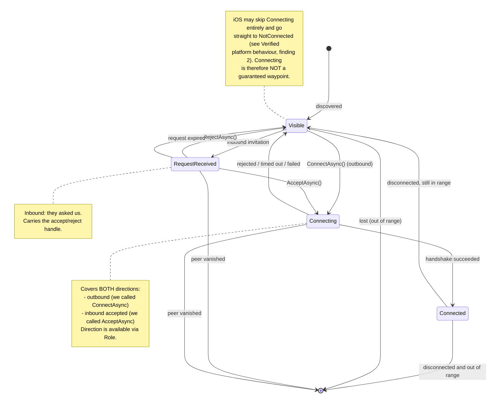
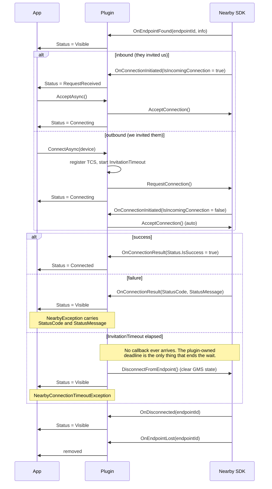
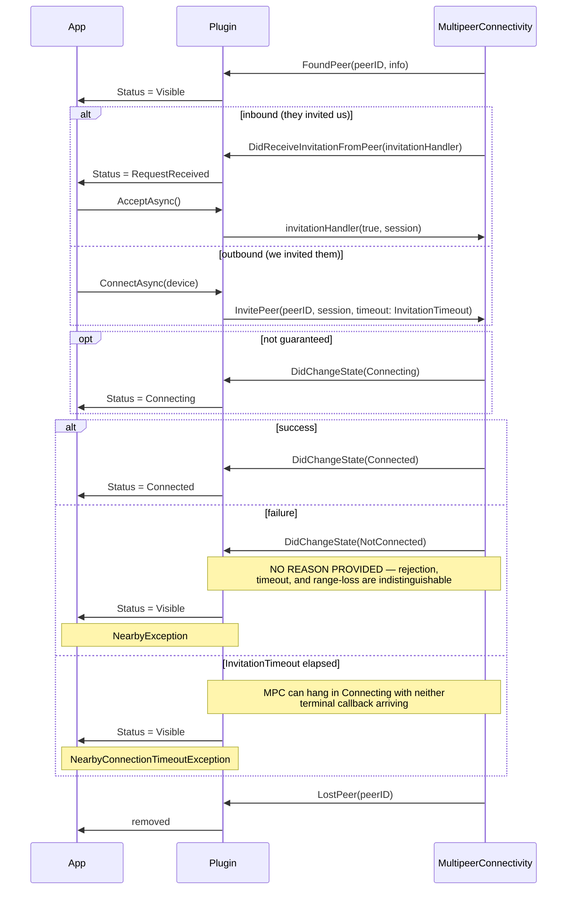
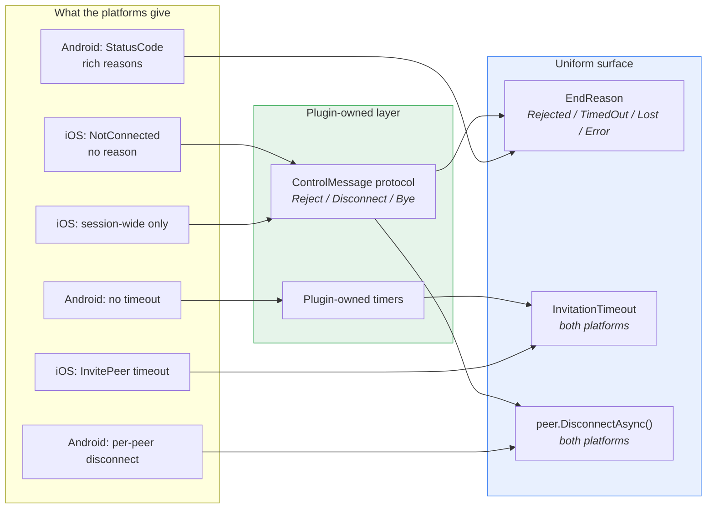

# Device Lifecycle — Capability Model

**Purpose:** Model the *pre-connection* phase (advertise / discover / request / accept / reject /
expire) as a first-class capability, distinct from established connections — and state honestly
which parts are native on both platforms, native on one, or a plugin extension.

This is a design reference for contributors. It documents what each platform SDK actually
guarantees, where they diverge, and which behaviour the plugin supplies itself.

> **Status — partly implemented.** The lifecycle model, `NearbyDeviceStatus`, and the single
> `Devices` collection shipped as described. Read "Proposed shape" below as history, not as the
> current API: the verbs live on `INearby` (`session.ConnectAsync(device)`), not on
> `NearbyDevice`, and there is no `LastEndReason`. Gaps 2 and 3 are closed; gaps 1 and 4 remain
> open. `INearby` is the source of truth.

---

## Naming constraint — vendor-neutral public vocabulary

**No public type or member borrows vocabulary from either platform SDK.** This extends the
reasoning that disqualified vendor-branded terms for the package name, extended down to the type
surface.

Measured against the current source, both candidate words are vendor terms:

| Term | Owner | Occurrences in `src/` |
|---|---|---|
| `Peer` | **Apple** — `MCPeerID`, `MCNearbyServiceBrowser`, MPC docs throughout | 36 × `MCPeerID`, plus `PeerKey`/`PeerId` |
| `Endpoint` | **Google** — `EndpointId`, `DiscoveredEndpointInfo`, `EndpointDiscoveryCallback` | 27 × `EndpointId`, plus callbacks |

Both are therefore **disqualified** for public API. `Peer` is the more dangerous of the two because
it *sounds* generic while being specifically MPC's term.

**Chosen public noun: `Device`** (`NearbyDevice`, `Devices`, `NearbyDeviceStatus`). Rationale:

1. **Vendor-neutral.** Neither SDK uses "device" as its identity type.
2. **MAUI-idiomatic.** The framework's own vocabulary is `DeviceInfo`, `DeviceDisplay`,
   `IDeviceInfo` — "device" is what .NET MAUI calls a physical thing running an app.
3. **Zero rename cost.** `NearbyDevice` is published API since preview.1. Keeping it means the
   rename table shrinks and the `Devices` naming stays consistent rather than flip-flopping.

**Internal code keeps `Peer`.** `PeerRegistry`, `PeerKeyProvider`, `PeerIdArchive` are `internal`,
never seen by a consumer, and sit at the layer that genuinely talks to `MCPeerID`. Using the
platform's word there is *correct*, not a leak. The rule is: public
says `Device`, internal says `Peer`, and the public/internal boundary is the enforcement mechanism.

> Candidates considered and rejected: `NearbyPeer` (Apple's term), `NearbyEndpoint` (Google's term),
> `NearbyParticipant` (neutral and semantically precise, but long, and `Participants` reads oddly
> for devices you have not connected to), `NearbyNode` (neutral but reads as mesh/graph
> infrastructure, unusual in MAUI app code).

---

## Why this document exists

A two-collection model captures only the stable endpoints:

```csharp
IReadOnlyList<NearbyDevice> Devices { get; }        // visible
IReadOnlyList<NearbyConnection> Connections { get; } // established
```

Those are the two *stable endpoints*. They skip the negotiation phase entirely — which is where
essentially all of the difficulty in P2P lives: two-sided handshakes, rejection, timeout, expiry,
and a peer vanishing mid-negotiation.

**The sample already proves the gap.** `DiscoveredDeviceViewModel` hand-rolls the missing state:

```csharp
[ObservableProperty]
public partial bool IsConnecting { get; private set; }   // ← outbound-pending, reinvented

async Task Connect()
{
    IsConnecting = true;
    try { await discoverer.ConnectAsync(Device); }
    catch (NearbyException) { IsConnecting = false; }   // ← manual unwind on failure
}
```

`AdvertisedDeviceViewModel` + `AdvertisingPageViewModel.AdvertisedDevices` are likewise a hand-rolled
pending-inbound list, rebuilt from replayed events on every `NavigatedTo`.

The plugin owns both platforms' state machines. The consumer should not have to rebuild them.

---

## The peer lifecycle



Five states. A two-collection model covers only `Visible` and `Connected`; the three middle states
are where the sample's hand-rolled code lives.

### ⚠ `Connecting` is not a guaranteed waypoint

Verified against Apple's own DTS guidance (see *Verified platform behaviour* below): on iOS a peer
can transition **directly from the invitation to `NotConnected`, never entering `Connecting`** — both
on a declined invitation (the common path) and, rarely, on error. Any implementation that treats
`Connecting` as a required transition, a gate, or the only place a pending flag gets reset **has a
latent hang**. The state machine above must be read as "`Connecting` is optional on every path that
passes through it."

This is not hypothetical for this codebase: it is a bug that has been hit and fixed before
(iOS `NotConnected` must fault the pending TCS or `AcceptAsync`/`ConnectAsync` hang forever), and
the current `NearbyConnections.ios.cs` handles it correctly by faulting on `NotConnected` without
requiring `Connecting` to have occurred. **Any refactor must preserve that property.**

---

## Platform mapping

### Android — Google Nearby Connections



### iOS — MultipeerConnectivity



---

## Capability matrix

Legend: **N** = native on both · **N¹** = native on one, synthesized on the other ·
**X** = plugin extension (no native equivalent) · **⚠** = asymmetric fidelity, must be documented

| Capability | Android | iOS | Class | Notes |
|---|---|---|---|---|
| Discover / lose a peer | `OnEndpointFound` / `OnEndpointLost` | `FoundPeer` / `LostPeer` | **N** | Clean parity. |
| Distinguish inbound vs outbound | `ConnectionInfo.IsIncomingConnection` | implicit (invitation callback vs. `InvitePeer`) | **N** | iOS is implicit but unambiguous at the call site. |
| Observe "negotiating" | `OnConnectionInitiated` | `MCSessionState.Connecting` | **N** | Both expose it; neither is surfaced today. |
| Established connection | `OnConnectionResult(IsSuccess)` | `MCSessionState.Connected` | **N** | |
| **Failure reason** | ✅ `StatusCode` + `StatusMessage` | ❌ bare `NotConnected` | **⚠** | **The key asymmetry.** Android can say *why*; iOS cannot. |
| Distinguish "rejected" from "timed out" | ✅ via status code | ❌ indistinguishable | **⚠** | On iOS both collapse to `Unknown`. |
| Invitation timeout | ❌ no native timeout | ✅ `InvitePeer(timeout:)`, `InvitationTimeout` (30s default) | **N¹** | Synthesize on Android with a timer to reach parity. |
| Inbound request expiry | ❌ | ❌ | **X** | Neither platform expires a *pending inbound* request. Plugin extension: expire on stop, and optionally on a timeout. |
| Pending state survives navigation | ❌ | ❌ | **X** | Both platforms are callback-only. Observable collection is the plugin's contribution. |
| Per-peer disconnect | ✅ `DisconnectFromEndpoint` | ❌ `MCSession.Disconnect()` tears down the whole session | **⚠** | Documented by expo-nearby-connections as a known divergence. |

### Verified platform behaviour (iOS / MultipeerConnectivity)

Confirmed against Microsoft Learn and Apple Developer Forums (DTS engineer responses), not inferred
from our wrapper. These five findings constrain the design:

1. **`MCSessionState` has exactly three cases** — `NotConnected` (0), `Connecting` (1),
   `Connected` (2). State is **per-peer**, delivered via the required
   `IMCSessionDelegate.DidChangeState(session, peerID, state)`.
2. **`Connecting` is not guaranteed to occur.** A peer can go directly to `NotConnected` — on a
   declined invitation (expected) and, rarely, on error. Apple DTS: *"detecting declined invites or
   dropped invites is something that is not well supported in these APIs… a lot of this ends up
   having to be handled with manual logic."* **This is the single most important constraint in this
   document.**
3. **`NotConnected` is overloaded and carries no `NSError`.** It means all of: declined, handshake
   failed, transport error, peer walked away, remote disconnected. There is no API to disambiguate.
4. **`Connecting` can hang indefinitely.** Documented case: Wi-Fi enabled but unassociated while
   cellular is active — neither `Connected` nor `NotConnected` ever arrives. Timeouts must be
   enforced by the caller via `InvitePeer(timeout:)`, never awaited from the delegate.
5. **`ConnectedPeers` lags the callback.** The departing peer is still in `session.ConnectedPeers`
   when `DidChangeState(…, NotConnected)` fires. (The current code relies on this; see review
   finding P2-1 for the empty-collection edge case it gets wrong.)
6. **Callbacks arrive on background threads** — MS Learn states this explicitly. Every observable
   collection mutation and `PropertyChanged` raise must be marshalled.

**Design consequence:** a `Connecting` status is still worth exposing (it is real, and Android
reports it reliably), but the plugin must drive `Visible`/`Connected` transitions from the
*terminal* callbacks alone, treating `Connecting` as advisory. A timeout the plugin owns — not a
state the platform promises — is what guarantees a peer never sticks in `Connecting` forever.

Sources: [MCSessionState](https://learn.microsoft.com/dotnet/api/multipeerconnectivity.mcsessionstate) ·
[IMCSessionDelegate](https://learn.microsoft.com/dotnet/api/multipeerconnectivity.imcsessiondelegate) ·
[Apple forum 129352](https://developer.apple.com/forums/thread/129352) ·
[Apple forum 811978](https://developer.apple.com/forums/thread/811978)

### The four honest gaps

1. **`EndReason` is richer on Android.** On iOS most failures report `Unknown` natively.
2. **Invitation timeout is native only on iOS.** Android has no native timeout.
3. **Per-peer disconnect is not achievable on iOS natively.** `MCSession.Disconnect()` is all-or-nothing.
4. **Inbound request expiry exists on neither platform.**

---

## Closing the gaps — a genuinely uniform API

Three of the four gaps close cleanly. The mechanism already exists in this codebase:
**`ControlMessage`** (`Connections/ControlMessage.cs`), an application-level wire protocol already
used to signal disconnect on iOS. Extending it turns platform-specific behaviour into plugin-owned,
uniform behaviour.



### Gap 1 — failure reason: **closeable to ~90%**

The insight: iOS can't tell you *why* natively, but **the rejecting peer knows why**. Send it.

```
RejectAsync()  →  ControlMessage.Reject  →  then tear down
```

The receiving side reads `Reject` immediately before `NotConnected` and reports
`EndReason.Rejected` with certainty — on **both** platforms. Timeout is likewise plugin-owned
(gap 2), so `TimedOut` is known. That leaves only genuine transport failure and peer-vanished as
`Lost`/`Error`, which is exactly the distinction Android's status codes give.

> Apple's own DTS engineer recommends precisely this: *"a lot of this ends up having to be handled
> with manual logic"* — an explicit reject message before disconnecting is the sanctioned workaround.

**Residual:** if the peer is killed mid-reject the message never arrives → `Lost`. Honest and rare.

### Gap 2 — invitation timeout: ✅ **CLOSED**

iOS has `InvitePeer(timeout:)`; Android has nothing — confirmed against Google's docs:
`requestConnection`'s Task completes when the request is *sent*, and nothing bounds how long a peer
may take to answer.

**Implemented** in `NearbyConnections.shared.cs` (`ConnectAsync`): `InvitationTimeout` moved from
iOS-only to shared, enforced by a plugin-owned `CancellationTokenSource` timed through the injected
`TimeProvider` so it is testable with `FakeTimeProvider`. Expiry throws
`NearbyConnectionTimeoutException`, distinguishable from caller cancellation. On Android the
timeout also calls `DisconnectFromEndpoint` (`PlatformAbandonConnectAsync`), without which Google
Play Services keeps the endpoint marked connected and every retry fails with
`STATUS_ALREADY_CONNECTED_TO_ENDPOINT`.

**Bonus, as predicted:** this also covers verified-behaviour finding 4 — the documented iOS case
where `Connecting` hangs forever with neither terminal callback arriving.

### Gap 3 — per-peer disconnect: ✅ **CLOSED**

`ControlMessage.Disconnect` is sent to the departing peer, and `MCSession` is torn down only when
the last peer leaves (`NearbyConnections.ios.cs`, the `NotConnected` case — note the
`connectedPeers.Length > 0` guard, which exists because `Enumerable.All` returns `true` for an empty
sequence and without it a failed handshake disposed the session out from under still-connected
peers). `INearby.DisconnectAsync(device)` is the public verb on both platforms.

Original analysis, retained for context:

`ControlMessage.Disconnect` already exists and is already sent on iOS before teardown. Completing it:
the receiver treats `Disconnect` as "this specific peer left," removes only that peer, and keeps the
`MCSession` alive for remaining peers. `MCSession.Disconnect()` is then called only when the *last*
peer departs — which the code already attempts (see review finding P2-1 for the empty-collection bug
to fix while here).

### Gap 4 — inbound request expiry: **plugin extension, uniform by construction**

Neither platform expires a pending inbound request. Because it is entirely plugin-owned, it is
uniform for free: one timer, one `EndReason.Expired`, identical on both platforms.

### Resulting capability matrix

| Capability | Before | After | Mechanism | Status |
|---|---|---|---|---|
| Failure reason | ⚠ Android only | uniform (~90%) | `ControlMessage.Reject` + owned timers | ⏳ **open** (gap 1) |
| Invitation timeout | ⚠ iOS only | ✅ uniform | Plugin-owned deadline, both platforms | ✅ **done** |
| Per-peer disconnect | ⚠ Android only | ✅ uniform | `ControlMessage.Disconnect` | ✅ **done** |
| Request expiry | ❌ neither | uniform | Plugin timer, both | ⏳ **open** (gap 4) |
| `Connecting` reliability | ⚠ iOS may skip | ✅ advisory + timeout-backed | Terminal-callback-driven | ✅ **done** |

### What this costs, honestly

- **A wire protocol both ends must speak.** Two devices running different plugin versions could
  disagree. Needs a version byte in `ControlMessage` — cheap now, expensive later.
- **A control message is not free.** It is an extra round trip on reject/disconnect. Negligible
  against handshake cost.
- **`EndReason.Rejected` is best-effort, not guaranteed.** A peer killed mid-reject reports `Lost`.
  Document as best-effort — do **not** claim certainty.
- **Scope.** Gaps 1 and 4 add new capability; gaps 2 and 3 complete work already started.
  Sequencing them is a scope decision, not a technical one.

---

## Proposed shape

State lives on the device; the collection carries the whole lifecycle.

```csharp
public enum NearbyDeviceStatus
{
    Visible,          // discovered, no negotiation in flight
    RequestReceived,  // inbound invitation awaiting AcceptAsync/RejectAsync
    Connecting,       // handshake in flight (either direction — see Role). ADVISORY: not
                      // guaranteed to be observed on iOS; see Verified platform behaviour.
    Connected,        // established; Connection is non-null
}

public sealed partial class NearbyDevice : ObservableObject   // INotifyPropertyChanged
{
    public string Id { get; }
    public string? DisplayName { get; }

    public NearbyDeviceStatus Status { get; }                 // observable
    public NearbyConnectionRole? Role { get; }                // who initiated; null while Visible
    public NearbyConnection? Connection { get; }              // non-null iff Connected
    public NearbyConnectionEndReason? LastEndReason { get; }  // best-effort — see gap 1

    public Task<NearbyConnection> ConnectAsync(CancellationToken ct = default);  // Visible only
    public Task<NearbyConnection> AcceptAsync(CancellationToken ct = default);   // RequestReceived only
    public Task RejectAsync(CancellationToken ct = default);                     // RequestReceived only
    public Task DisconnectAsync(CancellationToken ct = default);                 // Connected only
}
```

```csharp
public interface INearby : IAsyncDisposable
{
    IReadOnlyList<NearbyDevice> Devices { get; }   // INotifyCollectionChanged — every state

    bool IsAdvertising { get; }
    bool IsDiscovering { get; }

    Task StartAdvertisingAsync(CancellationToken ct = default);
    Task StartDiscoveryAsync(CancellationToken ct = default);
    Task StopAdvertisingAsync(CancellationToken ct = default);
    Task StopDiscoveryAsync(CancellationToken ct = default);
    Task StopAsync(CancellationToken ct = default);

    event EventHandler<NearbyPayloadReceivedEventArgs> PayloadReceived;
    event EventHandler<NearbySessionFaultedEventArgs> SessionFaulted;
}
```

> `NearbyDevice`/`Devices` requires no rename of published API. Only the *kind* of type changes —
> see the breaking change below.

### ⚠ Breaking change inside a type that keeps its name

`NearbyDevice` changes from an **immutable `record`** to an **observable class**:

```csharp
// today
public sealed record NearbyDevice(string Id, string? DisplayName)
{
    public bool Equals(NearbyDevice? other) => other?.Id == Id;   // Id-based equality
    public override int GetHashCode() => HashCode.Combine(Id);
}
```

This is the easy kind of change to get wrong, because the name and the `Id`/`DisplayName` members
are unchanged while the semantics shift underneath. Three properties **must** be preserved
deliberately:

1. **`Id`-based equality and `GetHashCode`.** `PeerRegistry` and `_activeConnections` key on device
   identity; silently reverting to reference equality would break every lookup. Override both
   explicitly on the class — a class does not inherit the record's generated equality.
2. **Identity stability across state transitions.** The *same* instance must move
   `Visible → Connecting → Connected`, mutating `Status`. Replacing the instance on each transition
   would break `INotifyPropertyChanged` bindings and defeat the entire model.
3. **Value-equality consumers.** Any existing `==`, `Contains`, or `Distinct` usage on
   `NearbyDevice` keeps working *only* because of point 1. Grep for these before landing.

Add a dedicated regression test asserting `Id`-equality survives the record→class conversion.

### Consumer consequences

**One collection, filtered per page** — no manual list maintenance, no replay, no `Synchronized`:

```xml
<CollectionView ItemsSource="{Binding IncomingRequests}" />
```
```csharp
// Advertising page
public IEnumerable<NearbyDevice> IncomingRequests =>
    Session.Devices.Where(d => d.Status is NearbyDeviceStatus.RequestReceived);

// Discovery page
public IEnumerable<NearbyDevice> Available =>
    Session.Devices.Where(d => d.Status is NearbyDeviceStatus.Visible or NearbyDeviceStatus.Connecting);
```

**Pending state survives navigation for free** — it is collection state, not a replayed event.

**Actions move onto the device.** `device.AcceptAsync()` instead of `advertiser.AcceptAsync(request)`.
Invalid transitions throw `InvalidOperationException` naming the current status.

### Effect on NearbyChat — simplification, not behaviour change

| Sample code | After |
|---|---|
| `DiscoveredDeviceViewModel.IsConnecting` + unwinding catches | **Deleted** — `Status == Connecting` |
| `AdvertisedDeviceViewModel` / `DiscoveredDeviceViewModel` | **Collapse to one** — same type, different filter |
| `AdvertisingPageViewModel.AdvertisedDevices` (manual list) | **Deleted** — filtered view |
| `NavigatedTo` rebuild-from-replay | **Deleted** — collection is already correct |
| Toggles, transfer, chat, `AutomationId`s | **Unchanged** |

No user-visible behaviour changes. Every capability the sample demonstrates today is preserved;
what disappears is the plumbing the sample wrote to compensate for the plugin's missing model.

---

## Open questions

1. ~~`Peers`/`NearbyPeer` vs `Devices`/`NearbyDevice`~~ — **Settled:** `NearbyDevice`/`Devices`.
   Vendor-neutral (both `Peer` and `Endpoint` are SDK terms), MAUI-idiomatic, and keeps published
   API. See *Naming constraint* above.
2. ~~**Does `NearbyConnection` stay a separate type**~~ — **Settled: separate.** Preserves the
   published type and keeps transfer concerns off the device.
3. ~~**Synthesize invitation timeout on Android**~~ — **Settled: synthesized.** See gap 2 above.
4. ~~**Per-peer disconnect on iOS**~~ — **Settled: emulated via `ControlMessage`.** See gap 3.
5. ~~**Does `Connections` survive**~~ — **Settled: no.** One `Devices` collection; consumers filter
   on `Status`. Two collections could disagree.
6. **Vendor-neutrality sweep** — **mostly done.** Zero `Android.Gms` / `MultipeerConnectivity`
   types remain in any PublicAPI baseline (verifiable by grepping them).
   - ~~`Strategy`~~ → **done:** `Topology : NearbyTopology`.
   - ~~`EncryptionPreference`~~ → **done:** `NearbyEncryptionPreference`.
   - ~~`ConnectionType`~~ → **done:** `NearbyConnectionType`. Was a raw `int` holding a Google
     constant — untyped *and* vendor-specific.
   - `NearbyOptions.ServiceId` → neutral enough, but its iOS semantics are Bonjour's
     `serviceType`; keep the name, keep documenting the platform difference.
   - **`InvitationTimeout` → still open.** "Invitation" is MPC vocabulary, and the option is now
     cross-platform, which makes the leak more visible rather than less. `ConnectionRequestTimeout`
     reads neutrally on both. Deliberately *not* renamed alongside the type work: it belongs with
     BACKLOG #2 (terminology) so the whole vocabulary is settled in one pass rather than piecemeal.
