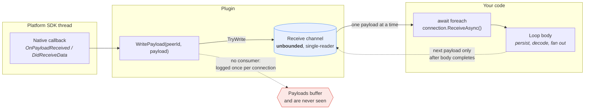

# Payload delivery

How inbound payloads reach the consumer, and why the plugin delivers them as an **async stream**
rather than as an event.

This concerns only *post-connection* data flow. Connection establishment — the
`TaskCompletionSource` handshake in `_connectionTcs`, its cancellation plumbing, and the
resolve/fault contract — is a separate mechanism and is unaffected by anything here. See
[`DEVICE-LIFECYCLE.md`](DEVICE-LIFECYCLE.md) for that.

---

## The rule

> **Lifecycle notifications are C# events. Payloads are an async stream, consumed one connection at
> a time with `await foreach`.**

Two kinds of thing with two different shapes, because they have genuinely different requirements.

| | Shape | Why |
| --- | --- | --- |
| Device found/lost, connection requested/established/dropped | `event EventHandler<T>` | Multi-consumer, handlers are fast and synchronous, no I/O |
| Inbound payloads | `IAsyncEnumerable<NearbyPayload>` | Single consumer, handlers do real async work, order matters |

```csharp
await foreach (var payload in connection.ReceiveAsync())
{
    await ProcessAsync(payload);   // may await freely; loop ends on disconnect
}
```

---

## The delivery path



Three properties follow from this shape, and each is load-bearing:

| Property | Consequence |
| --- | --- |
| The channel is **unbounded** | A slow consumer grows memory. It never slows the remote sender. |
| The channel is **single-reader** | `ReceiveAsync` throws on a second call. Fan out above the plugin. |
| The loop body **gates the dequeue** | Handlers may `await` freely without losing or reordering payloads. |

The dashed red path is the failure mode worth knowing: nothing forces a connection to be consumed.
If no one calls `ReceiveAsync`, payloads accumulate in the channel silently — the plugin logs a
warning once per connection (`LogPayloadArrivedUnobserved`), but there is no exception and no
back-pressure signal to the sender.

---

## Why payloads are a stream

### The loop body is the backpressure seam

The next payload is not dequeued until the body of your `await foreach` completes. A handler may
`await` — decode a file, generate a video thumbnail, write to a database — without losing payloads
or reordering them.

An `EventHandler<T>` returns `void` and cannot express "finish handling this one before delivering
the next." Every workaround is worse:

| Workaround | Failure |
| --- | --- |
| `async void` handler | Exceptions become unhandled crashes; ordering is lost |
| `_ = ProcessAsync(...)` fire-and-forget | Two payloads arriving back-to-back interleave; order breaks |
| Block synchronously inside the handler | Deadlock risk on the dispatcher |

This is not hypothetical. The sample's `ChatMessageService` awaits video-thumbnail generation while
handling a payload; with an event it would either crash on failure or render thumbnails against the
wrong messages.

Note that this is *sequential async consumption*, *not* throttling of the sender: the receive channel
is unbounded, so a slow consumer grows memory rather than slowing the remote peer. Backpressure in
the "make the producer wait" sense is not something this plugin provides on either shape.

### Single consumer is the honest contract

`ReceiveAsync` reads a `Channel<NearbyPayload>`. A channel reader is a *data pipe*, not a broadcast:
items read by one enumerator are permanently removed. Calling it twice throws:

```csharp
if (Interlocked.Exchange(ref _receiveGuard, 1) != 0)
{
    throw new InvalidOperationException("ReceiveAsync may only be called once per connection…");
}
```

That restriction used to be a genuine problem, because the plugin's own Tier-2 forwarding loop
claimed the single enumeration for every established connection — making a public `ReceiveAsync`
throw for any other caller, 100% of the time. **That loop no longer exists.** With
`ConnectionLifecycle.ForwardPayloadsAsync` deleted, nothing competes for the enumeration, and the
one-consumer rule is simply the documented contract.

### Fan-out belongs above the plugin, not inside it

When several components need inbound data, consume the stream once and publish an
application-level message from inside the loop. The sample does exactly this and is the model:

```csharp
await foreach (var payload in connection.ReceiveAsync())
{
    var message = await BuildChatMessageAsync(payload);   // async work, in order
    _repository.Save(device, message);
    _messenger.Send(new ChatMessageReceived(device, message));   // fan-out happens here
}
```

`ChatViewModel` is an `IRecipient<ChatMessageReceived>` — it consumes *chat messages*, not raw
payloads. This is the right layering: the plugin delivers bytes and files; the application decides
what they mean and who cares. A multi-consumer payload API would push that decision down into the
plugin, where it has no domain knowledge to make it with.

---

## Ending the loop

The receive stream completes on its own when the peer disconnects or `DisposeAsync` is called —
`CompleteReceive` completes the channel writer, `ReadAllAsync` drains whatever is still buffered, and
the loop exits normally. Payloads that arrived immediately before the disconnect are therefore
**delivered, not dropped**.

> ⚠️ **Do not pass `DisconnectedToken` to `ReceiveAsync`.** It is unnecessary — the loop already ends
> on disconnect — and actively harmful: `ReadAllAsync` observes cancellation on *every* iteration, so
> a cancelled token throws `OperationCanceledException` and discards the buffered payloads from just
> before the disconnect, which are usually the ones worth keeping.
>
> `DisconnectedToken` exists to cancel *your own* per-connection work — a retry loop, a periodic
> ping, an upload started on the peer's behalf. Pass your own token to `ReceiveAsync` only when the
> loop must stop for a reason of your own.

`NearbyConnectionTests.DisconnectedToken` pins both behaviours, including a test asserting the misuse
above still throws, so the guidance cannot silently drift from the implementation.

---

## What this costs

Stated plainly, because these are real:

| Cost | Impact |
| --- | --- |
| **One consumer per connection** | Multiple interested components require an application-level fan-out (a messenger, an event, a subject). ~3 lines, as in the sample. |
| **Manual loop management** | Someone must start the `await foreach` per connection and keep it running. Typically a single service subscribing to `ConnectionEstablished`. |
| **Consumer must exist before the connection does** | `ConnectionEstablished` is a plain event with no replay — see below. |
| **No LINQ-over-events ergonomics** | Not an issue in practice — the loop body is where processing goes. |

### Your consumer must be constructed before the first connection

`ConnectionEstablished` does not replay. A consumer that subscribes after a connection is already
established never starts a loop for it, so inbound payloads are written to a channel nobody reads and
the peer's messages **silently never arrive** — no exception, no log, just nothing.

This bites hardest with DI. Registering the consumer as a singleton is not enough: the container
constructs a singleton lazily, on first resolution. If the only thing that resolves it is a page or
ViewModel opened *after* connecting, it is constructed too late and misses the event that would have
started its loop.

**Use MAUI's startup hook, `IMauiInitializeService`.** MAUI calls `Initialize` during
`MauiAppBuilder.Build()`, so "runs at startup" becomes a property of the type rather than a side
effect of who happens to inject it:

```csharp
public sealed class NearbyIngestionService(INearbyConnections session, /* … */) : IMauiInitializeService
{
    public void Initialize(IServiceProvider services)
    {
        session.ConnectionEstablished += (_, e) => _ = ConsumePayloadsAsync(e.Connection);
    }
}

// TryAddEnumerable: MAUI invokes these via GetServices<T>(), so a duplicate
// registration would subscribe twice and deliver every payload twice.
builder.Services.TryAddEnumerable(
    ServiceDescriptor.Singleton<IMauiInitializeService, NearbyIngestionService>());
```

Avoid the tempting shortcut of injecting the consumer into `App`'s constructor purely to force it
into existence. It works, but it is a load-bearing side effect: the parameter is unused, so the next
person to clean up "an unused dependency" silently reintroduces the bug.

### Keep ingestion separate from send/query

Give the startup-critical loop its own type. If one service owns both payload ingestion *and* the
send/query API a ViewModel calls, then that service is startup-critical, and every consumer of the
send API inherits a lifetime constraint it has no reason to care about. Split them: only the
ingestion service needs `IMauiInitializeService`, and the send service goes back to being an
ordinary lazily-resolved singleton.

### Persistence: scope per payload

If the loop writes to a database, the ingestion singleton must **not** hold the repository. An EF
Core `DbContext` is scoped and not thread-safe; capturing one in a singleton pins it for the life of
the app and shares it across operations that must not share it. Resolve one unit of work per payload
instead — and awaiting that write inside the loop is exactly what the backpressure guarantee is for,
since the next payload is not dequeued until it completes:

```csharp
await foreach (var payload in connection.ReceiveAsync())
{
    await using var handle = _repositoryFactory.Create();   // one unit of work
    await handle.Repository.SaveAsync(device, message);     // stream waits for the write
}
```

Injecting a small factory abstraction, rather than `IServiceProvider`, keeps service location out of
the consumer — see `IChatMessageRepositoryFactory` in [`samples/NearbyChat`](../samples/NearbyChat).

### The plugin warns you

Because this failure is otherwise completely silent, the plugin logs a warning at `Warning` level in
two places. Neither changes behaviour — they exist so the bug is discoverable without a debugger:

| Warning | Fires when |
| --- | --- |
| `…nothing is subscribed to ConnectionEstablished` | A connection is established while the event has no subscribers. |
| `…ReceiveAsync was never called for this connection` | A payload arrives on a connection nobody is consuming. Logged once per connection, not per payload. |

The second is the more reliable signal: it fires even when *something* subscribed but never started a
loop. If you see either, an inbound message has already been lost. Enable plugin logging while
developing:

```csharp
builder.Logging.AddFilter("Plugin.Maui.NearbyConnections", LogLevel.Warning);
```

## Where events are still the right answer

Everything that is a *notification of state* rather than a *sequence of data*: devices appearing and
disappearing, connection requests arriving, connections establishing and dropping. Those have many
interested consumers, need no ordering guarantee beyond "eventually", and their handlers do no I/O.
They are plain C# events on `INearbyConnections`, raised on the dispatcher.
