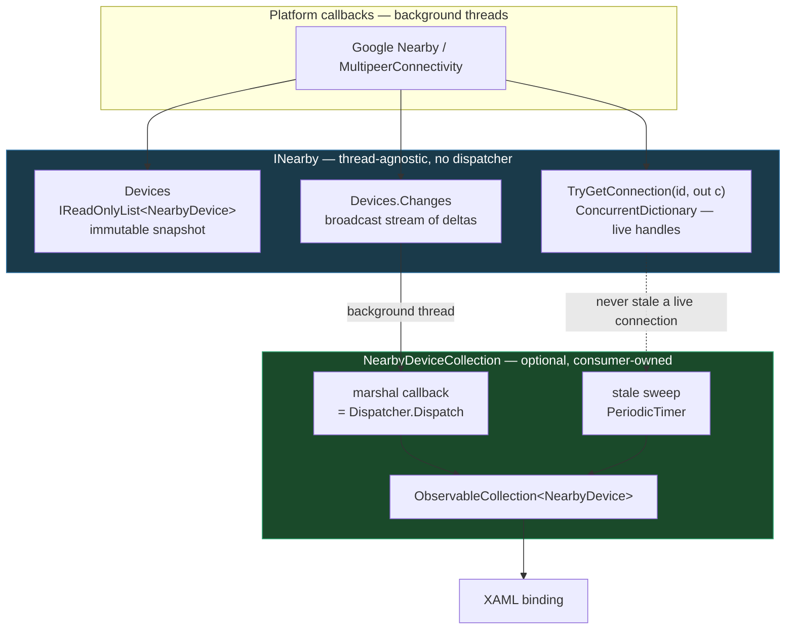

# Presence, connections, and the two layers

Status: proposal, not decided. Written 2026-08-09.

## The core issue

`NearbyDevice` is a **mutable object shared by two threads**. The library must mutate it — platform
callbacks are the only source of truth. The UI must read it — it is what is on screen.

Given shared mutable state there are three exits, and no fourth:

1. **Pick a thread and force everything onto it** ← today. The dispatcher is the price of this
   option, not an independent choice.
2. **Lock it.** Nobody does this: `PropertyChanged` still needs marshalling for binding, so you pay
   for locks *and* keep the dispatcher.
3. **Stop sharing a mutable object.** Nothing to race over, so no thread rules exist.

Two live defects descend from (1): `DisconnectAsync` (`NearbyImplementation.cs:333`) and `StopAsync`
(`:216`) both read device state off the dispatcher thread while the dispatcher is the only writer.
`_stateGate` guards start/stop, not the collection — the collection's lock is the UI thread.

## What the ecosystem actually does

Two libraries with this exact problem, read from source.

### Plugin.BLE — events, no adapter

`IAdapter` is thread-agnostic: `DeviceDiscovered`, `DeviceConnected`, `DeviceDisconnected` fire on
background threads, and **`DiscoveredDevices` and `ConnectedDevices` are separate `IReadOnlyList`
properties**. Presence and connections are not the same collection.

The cost lands in every consuming app. From Plugin.BLE's own MAUI sample
(`BLE.Client.Maui/ViewModels/BLEScannerViewModel.cs`):

```csharp
private void AddOrUpdateDevice(IDevice device)
{
    MainThread.BeginInvokeOnMainThread(() => {
        var vm = BLEDevices.FirstOrDefault(d => d.DeviceId == device.Id);
        if (vm != null) { vm.Update(device); }
        else { BLEDevices.Add(new BLEDeviceViewModel(device)); }
    });
}
```

Hand-written find-by-id, update-or-add, wrapped in `MainThread`. Every app writes this.

### Shiny — a thread-agnostic core plus an optional managed layer

`IBleManager` is the core, and it is *streams and lookups*, never a bindable collection:

```csharp
IObservable<ScanResult> Scan(ScanConfig? scanConfig = null);
IEnumerable<IPeripheral> GetConnectedPeripherals();
IPeripheral? GetKnownPeripheral(string peripheralUuid);
```

`IManagedScan` is a **separate, disposable, consumer-constructed** object that does exactly what
Plugin.BLE makes each app do by hand:

```csharp
public interface IManagedScan : IDisposable
{
    INotifyReadOnlyCollection<ManagedScanResult> Peripherals { get; }
    IScheduler? Scheduler { get; }                    // consumer supplies the thread
    TimeSpan? ClearTime { get; }                      // stale-device eviction
    IObservable<(ManagedScanListAction Action, ManagedScanResult? ScanResult)> WhenScan();
}
```

Four things this settles:

- **Connections are looked up separately from presence** (`GetConnectedPeripherals`,
  `GetKnownPeripheral`). Both libraries do this. It is not a judgement call.
- **The thread is a parameter of the optional layer**, not baked into the core.
- **Changes are deltas** — `ManagedScanListAction` is `Add`/`Update`/`Remove`/`Clear`, not a
  whole-list snapshot.
- **Presence needs eviction.** `ClearTime` plus a periodic sweep, because neither platform reliably
  reports every departure. This repo has no equivalent today; `Lost` is the only removal path.

## Proposal: the same two layers



**Consumers who want a background-safe library** use the core and never touch the managed layer.
**Consumers who want to bind** construct one `NearbyDeviceCollection` and get today's ergonomics
back. Neither pays for the other.

A full sketch of the managed layer is in `docs/examples/NearbyDeviceCollection.cs` (~200 lines with
docs; the mechanism is about 80).

## No new dependency

Shiny needs System.Reactive because its whole API is Rx. This repo does not:

| Shiny | Here | Where it comes from |
|---|---|---|
| `IObservable<ScanResult>` | `IAsyncEnumerable<T>` over `Channel<T>` | BCL — already the idiom in `NearbyConnection.ReceiveAsync` |
| `IScheduler` | `Action<Action> marshal` callback | none — a delegate |
| `ShinySubject` (broadcast) | one `Channel` per watcher | BCL |
| `BindingList<T>` | `ObservableCollection<T>` | BCL |
| `.Buffer(TimeSpan)` | `PeriodicTimer` | BCL |

**Why a marshal callback and not `IDispatcher`:** taking `IDispatcher` would make the managed layer
MAUI-only, so it could not exist on the `net10.0` target and the three PublicAPI baselines would
diverge — which `.claude/rules/naming.md` forbids. A callback keeps it platform-neutral and unit
testable, and the consumer passes `Dispatcher.Dispatch` in one line.

## The public API, before and after

The radio-control members stay flat. Only presence changes shape.

```csharp
public interface INearby
{
    // ── UNCHANGED (12) ──────────────────────────────────────────────────
    bool IsAdvertising { get; }
    bool IsDiscovering { get; }
    Task<NearbyAvailability> CheckAvailabilityAsync(CancellationToken ct = default);
    Task StartAdvertisingAsync(CancellationToken ct = default);
    Task StopAdvertisingAsync(CancellationToken ct = default);
    Task StartDiscoveryAsync(CancellationToken ct = default);
    Task StopDiscoveryAsync(CancellationToken ct = default);
    Task StopAsync(CancellationToken ct = default);
    Task<NearbyConnection> ConnectAsync(NearbyDevice device, CancellationToken ct = default);
    Task<NearbyConnection> AcceptAsync(NearbyDevice device, CancellationToken ct = default);
    Task RejectAsync(NearbyDevice device, CancellationToken ct = default);
    Task DisconnectAsync(NearbyDevice device, CancellationToken ct = default);

    // ── RESHAPED (1) ────────────────────────────────────────────────────
    INearbyDevices Devices { get; }   // was a live observable collection

    // ── REMOVED (3) ─────────────────────────────────────────────────────
    // event ... ConnectionRequested;     → Devices.Changes carries the status transition
    // event ... ConnectionEstablished;   → likewise
    // event ... ConnectionDropped;       → likewise

    // ── ADDED (1) ───────────────────────────────────────────────────────
    bool TryGetConnection(string deviceId, out NearbyConnection connection);
}

/// The devices known to the session: the current set, and the stream of changes to it.
public interface INearbyDevices : IReadOnlyList<NearbyDevice>
{
    IAsyncEnumerable<NearbyDeviceChange> Changes { get; }
}
```

Sixteen members become fourteen. `Devices` keeps its name and stays enumerable, so every existing
read compiles unchanged — `_session.Devices.Where(d => d.Status is …)`
(`AdvertisingPageViewModel.cs:112`) is untouched — while `Devices.Changes` replaces a standalone
`WatchDevicesAsync()`. A property here matches `NearbyConnection.Disconnected`, which is a property
rather than a `WatchDisconnectAsync()` method: one idiom for "the stream of what happens to this
thing".

`INearbyDevices` is a noun-phrase interface, which the Framework Design Guidelines discourage in
general — but it is a *collection*, where noun names are the convention (`IReadOnlyList`,
`ICollection`, `INotifyCollectionChanged`).

### Rejected: grouping the radio controls

Eight of the sixteen members are radio control — `Start`/`Stop`/`Is` for advertising and again for
discovery — and they are visibly the same three operations written twice.
`AdvertisingPageViewModel.cs:59-80` and `DiscoveryPageViewModel.cs:60-88` are line-for-line
identical apart from the word. The implementation already treats them as one thing: `_advertise` and
`_discover` are both `PumpState`, constructed identically (`NearbyImplementation.cs:48-49`).

The tempting fix is to nest them — `nearby.Advertising.StartAsync()`, with advertising and discovery
sharing one type. It was explored and rejected on three independent grounds:

1. **`.claude/rules/naming.md:34-35` already decided it.** The banned list — `Session`, `Advertiser`,
   `Browser`, `Strategy` — exists to stop a startable activity being named as *a thing you hold*:
   "the consumer-facing object is a capability, not a session." A shared `INearbyMode` (or
   `INearbyActivity`, `INearbyCapability`, …) is a new name for exactly that banned shape. The ban
   was never about those particular words.
2. **The Framework Design Guidelines point away from an interface.** "DO name interfaces with
   adjective phrases… Nouns and noun phrases should be used rarely and they **might indicate that
   the type should be an abstract class**." Every candidate name is a noun — which is the guideline
   saying the shared thing is an implementation base, not a contract. It already is one:
   `PumpState`, internal.
3. **The closest first-party analogue stays flat.** MAUI Essentials' `IGeolocation` exposes
   `IsListeningForeground`, `StartListeningForegroundAsync`, `StopListeningForeground` directly on
   the interface, with no sub-object — the same start/stop/is-active triple, kept flat.

The naming difficulty was the signal, not an obstacle to route around: there is no good name for the
union because the union is not a domain concept. What it costs is that the two page ViewModels
cannot share a toggle base class. That is not worth amending a binding contract for, and the
duplication stays where it is already unified — in `PumpState`, internal.

**Also rejected: splitting presence from connections.** `INearbyPresence` + `INearbyConnections` is
the wrong seam. Measured across `samples/NearbyChat`, the substantial consumers use both:

| Consumer | Members used |
|---|---|
| `AdvertisingPageViewModel` | `Devices`, all three events, `IsAdvertising`, start/stop |
| `DiscoveryPageViewModel` | `Devices`, two events, `IsDiscovering`, start/stop |
| `ConnectionTracker` | `Devices` |
| `NearbyIngestionService` | two events |
| `DiscoveredDeviceViewModel` | `ConnectAsync` |

Both page ViewModels would inject two interfaces to do one job — a constructor parameter bought with
no separation.

### Member-by-member

```csharp
// UNCHANGED (12)  IsAdvertising, IsDiscovering, CheckAvailabilityAsync,
//                 Start/StopAdvertisingAsync, Start/StopDiscoveryAsync, StopAsync,
//                 ConnectAsync, AcceptAsync, RejectAsync, DisconnectAsync
// RESHAPED (1)    Devices: live observable collection → INearbyDevices (snapshot + Changes)
// REMOVED (3)     ConnectionRequested / ConnectionEstablished / ConnectionDropped
//                 → Devices.Changes carries every status transition
// ADDED (1)       TryGetConnection
```

`NearbyDevice` becomes a value, and `DeviceState` deletes entirely:

```csharp
// before — mutable, observable, plus a 4-case hierarchy carrying a live connection
public sealed class NearbyDevice : INotifyPropertyChanged
{
    public string Id { get; }
    public string? DisplayName { get; internal set; }
    public DeviceState State { get; internal set; }    // holds NearbyConnection
    public NearbyDeviceStatus Status { get; }          // projection of State
    public event PropertyChangedEventHandler? PropertyChanged;
}

// after
public sealed record NearbyDevice(string Id, string? DisplayName, NearbyDeviceStatus Status);

public sealed record NearbyDeviceChange(NearbyDeviceChangeAction Action, NearbyDevice Device);

public enum NearbyDeviceChangeAction { Added, Updated, Removed }
```

Net: **`DeviceState` plus its four nested cases disappear**, and so do
`NearbyConnectionRequestedEventArgs` and one of the two `NearbyConnectionChangedEventArgs` uses —
roughly 40 lines of `PublicAPI.Unshipped.txt` per TFM. Two types are added
(`NearbyDeviceChange`, `NearbyDeviceChangeAction`). The surface gets *smaller*.

Reading a connection changes shape:

```csharp
// before
if (device.State is DeviceState.Connected { Connection: var connection })
    await connection.SendAsync(payload, ct);

// after
if (nearby.TryGetConnection(device.Id, out var connection))
    await connection.SendAsync(payload, ct);
```

### Why `ConnectionRequested` is not a request/response

An earlier draft called this one a *question the consumer must answer*, and weighed keeping it an
event against making it a single-consumer pipe (`IncomingRequestsAsync`). Reading the sample shows
both framings are wrong.

`OnConnectionRequested` (`AdvertisingPageViewModel.cs:125-126`) does not answer anything — it adds a
row. The answer comes later, from somewhere else entirely: a button on `AdvertisedDeviceViewModel`
calling `session.AcceptAsync(Device)`. **There is a human in between.**

That rules out the pipe shape, which assumes the loop body decides:

```csharp
await foreach (var request in nearby.IncomingRequestsAsync(ct))
{
    await request.AcceptAsync(ct);   // who decides? a user tapping a button, seconds later
}
```

Driving a UI from that means parking a `TaskCompletionSource` inside the loop and waiting for a tap
— and because the loop is serial, a second device's request would stay invisible until the first was
answered.

The request/response pair already exists and is not the event: `NearbyConnectionRequest` carries
`AcceptAsync` and `RejectAsync` (`Connections/NearbyConnectionRequest.cs:48,58`). The event only
announces *that a request arrived*, which is a plain notification — and a notification that a device
changed status to `RequestReceived`.

So it collapses into the presence stream with the other two:

```csharp
await foreach (var change in nearby.Devices.Changes)
{
    if (change.Device.Status is NearbyDeviceStatus.RequestReceived)
        // show the accept/decline row
}
```

The sample already behaves this way. `AdvertisingPageViewModel.cs:112` seeds from
`_session.Devices.Where(d => d.Status is NearbyDeviceStatus.RequestReceived)` on navigate-in
precisely because the event has no replay — so today's code needs two paths, a seed and a
subscription, to cover one concept. With presence as the source they become one.

`INearby.AcceptAsync` and `RejectAsync` do not change. They keep finding the pending request through
`_pendingRequests` (`NearbyImplementation.cs:287`), which is already the same keyed-lookup pattern
proposed for connections.

**This also drops `NearbyConnectionRequestedEventArgs` from the public surface** — one fewer type,
on top of `DeviceState` and its four cases.

#### `AutoAcceptConnectionRequests` confirms this

`NearbyOptions.AutoAcceptConnectionRequests` (shipped 2026-08-09) lets an application skip answering
entirely: the session accepts on its behalf in `AutoAcceptAsync`
(`NearbyImplementation.state.cs`), never publishes to `_pendingRequests`, and never raises
`ConnectionRequested`. The device moves `Visible → Connecting → Connected`, so
`RequestReceived` is simply a state that does not occur in that mode.

Under status-change delivery this needs no special handling — a consumer watching
`Devices.Changes` sees one progression with a state skipped, exactly as it sees for an outbound
connection.

Under the rejected pipe shape it would have been a genuine design problem. `IncomingRequestsAsync`
implies every item requires an answer, so with auto-accept enabled the stream would either yield
nothing while connections visibly formed, or yield already-answered requests whose `AcceptAsync`
throws. A shape that breaks under a supported option is the wrong shape.

One gap this closes, unrelated to auto-accept: a request that expires unanswered under
`InvitationTimeout` is a status change back to `Visible`, which the presence stream carries.
`ConnectionRequested` has no expiry counterpart today, so nothing tells a consumer the row it is
showing is dead.

## Consumer delta

### With the managed layer — smaller than today

```csharp
// before — DiscoveryPageViewModel.cs:99-109, plus Rebuild() at :134-157
RegisterSessionSubscription(
    () => ((INotifyCollectionChanged)_session.Devices).CollectionChanged += OnDevicesChanged,
    () => ((INotifyCollectionChanged)_session.Devices).CollectionChanged -= OnDevicesChanged);
RegisterSessionSubscription(
    () => _session.ConnectionEstablished += OnConnectionChanged,
    () => _session.ConnectionEstablished -= OnConnectionChanged);
RegisterSessionSubscription(
    () => _session.ConnectionDropped += OnConnectionChanged,
    () => _session.ConnectionDropped -= OnConnectionChanged);
Rebuild();

// after
_devices = new NearbyDeviceCollection(_session, Dispatcher.Dispatch, TimeSpan.FromSeconds(30));
```

`Rebuild()` deletes. `RegisterSessionSubscription` deletes. `BasePageViewModel`'s whole
subscription-tracking mechanism deletes — disposal replaces it, and the leak class it guards against
stops being expressible.

### Without it — one `Dispatch`, consumer keeps control

```csharp
await foreach (var change in _session.Devices.Changes.WithCancellation(NavigationToken))
{
    // background thread; may await here, which an event handler could not
    await Dispatcher.DispatchAsync(() => ApplyChange(change));
}
```

### Row view models either way

```csharp
// before — DiscoveredDeviceViewModel.cs:22 — subscribed, never unsubscribed
Device.PropertyChanged += OnDevicePropertyChanged;

// after — a value replaced in place; the collection's Replace notification updates the row
[ObservableProperty]
[NotifyPropertyChangedFor(nameof(IsConnecting))]
public partial NearbyDevice Device { get; set; }
```

This removes a live sample bug: rows subscribe at `DiscoveredDeviceViewModel.cs:22` and are dropped
at `DiscoveryPageViewModel.cs:144` without unsubscribing.

## Trade

| Gain | Cost |
|---|---|
| Core callable from any thread | Public API break: `Devices` semantics, `NearbyDevice`, 3 events |
| Two off-thread read races fixed structurally | Broadcast fan-out is new machinery to write and test |
| Binding consumers write *less* than today | `DeviceState` hierarchy retired |
| `RegisterSessionSubscription` + its leak class deleted | 3 × `PublicAPI.Unshipped.txt` rewrite |
| Stale-device eviction gained (currently absent) | Managed layer is ~80 lines to maintain |
| Smaller public surface | Sample edits across 4 files |
| One idiom: `await foreach` for payloads *and* presence | |
| No new dependency | |

## Open questions

1. **~~Snapshot or delta?~~** Settled — delta. Shiny shipped `Add`/`Update`/`Remove`/`Clear`; a
   whole-list snapshot forces every consumer to re-diff.
2. **~~`ConnectionRequested`: event or stream?~~** Settled — neither. See
   "Why `ConnectionRequested` is not a request/response" above.
3. **`ConnectAsync(NearbyDevice)` or `ConnectAsync(string id)`?** With value devices a stale
   snapshot becomes expressible. Id-only makes staleness inexpressible. Equality is already
   `Id`-only (`NearbyDevice.cs:19-23`), so the stale case resolves correctly either way.
4. **~~Does the managed layer ship in this package or the sample?~~** Settled — **ships in the NuGet
   package**, as `NearbyDeviceCollection`. Matches Shiny, where `ManagedScan` ships alongside
   `IBleManager`, and keeps binding consumers from hand-writing the marshalling loop that
   Plugin.BLE's sample demonstrates. It stays optional: nothing in the core references it, and it is
   not DI-registered. The `Action<Action> marshal` callback is what lets it ship on all three TFMs
   with identical PublicAPI baselines.
5. **~~Default `staleAfter`?~~** Settled — **30 seconds**. Shiny defaults to no eviction, but that
   only works because its consumers already opt in per scan; here the collection is the DX-friendly
   path, and a device that walked out of range silently lingering forever is the wrong default for
   it. `null` still disables eviction for callers who want platform "lost" signals to be the only
   removal path.

## Sequencing

1. ~~**Connections out of `DeviceState`**~~ — **DONE.** `DeviceState` deleted, `NearbyDevice` now
   stores `Status` + nullable `Role`, connections live in a `ConcurrentDictionary` behind
   `INearby.TryGetConnection`. Both off-thread races fixed. `naming.md` amended.
2. ~~**`NearbyDevice` → record, `Devices.Changes`, events removed**~~ — **DONE.** `NearbyDevice` is
   a record with `Id`-only equality; `INearbyDevices` exposes the snapshot plus a broadcast
   `Changes` stream backed by `NearbyDeviceRegistry`; all three events and both `EventArgs` types
   are gone; the session no longer takes an `IDispatcher`.
3. ~~**`NearbyDeviceCollection`**~~ — **DONE.** Ships in the package, implements
   `IReadOnlyList<NearbyDevice>` + `INotifyCollectionChanged` (see the CA1711 note on the type).

### What step 2 cost that was not in the plan

- **`EndReason` is no longer observable.** It travelled on `NearbyConnectionChangedEventArgs.Reason`
  and nothing replaced that: a dropped device returns to `Visible`, which carries no reason, so
  `EndReason` now reaches logs only. Reattaching it to the transition — a nullable reason on
  `NearbyDeviceChange`, or a separate connection-ended stream — is unresolved and worth doing
  before 1.0.
- **The "nobody is listening" guardrail is gone.** `ConnectionEstablished` could count subscribers;
  a broadcast stream cannot, so the warning that caught a consumer constructed too late to start a
  receive loop no longer exists. `PlatformNearby`'s once-per-connection "payload arrived but
  `ReceiveAsync` was never called" warning is what remains, and it fires one step later.
- **`NearbyIngestionService` needs its own dedupe.** The stream reports status transitions, not
  connection events, so it tracks which devices already have a receive loop. Without that set, any
  further change to a connected device starts a second consumer and every payload is handled twice.

### Step 1 — implementation checklist

Do this one alone. It is a coherent single-threaded refactor: every file below depends on the
others, so there is nothing to parallelise.

**The change in one sentence:** a live `NearbyConnection` stops living inside `DeviceState.Connected`
and moves to a `ConcurrentDictionary<string, NearbyConnection>` keyed by device id, so reading a
connection is a thread-safe lookup instead of a read of dispatcher-owned mutable state.

**What `DeviceState` becomes.** With `Connection` gone, `Connected` carries only `Role` — so the
four-case hierarchy no longer earns its keep. Collapse it: delete `DeviceState` and its four nested
records, keep `NearbyDeviceStatus` as the only state type, and move `Role` onto `NearbyDevice` as a
nullable `ConnectionRole?` (null unless connecting or connected). `NearbyDevice.Status` stops being
a projection and becomes the stored value, which retires the dual-raise invariant in
`.claude/rules/naming.md` — amend that section in the same commit.

**Files that change:**

| File | What |
|---|---|
| `NearbyImplementation.cs` | Add `_connections` dictionary beside `_pendingRequests` (`:40`). `:222` reads the dictionary, not `_devices`. `:337` `DisconnectAsync` becomes a lookup — **this is one of the two race fixes**. `:267`, `:297` set status + role instead of constructing states. |
| `NearbyImplementation.state.cs` | `:160`, `:195`, `:229`, `:261`, `:267`, `:288` — same substitution. `:229` `OnConnectedAsync` also inserts into the dictionary; `:261` `WatchDisconnectAsync` removes from it. Keep the `ReferenceEquals` identity guard at `:261` — it still matters. |
| `Devices/DeviceState.cs` | Delete. |
| `Devices/NearbyDevice.cs` | `:33` drop the `_state` field; `Status` becomes a stored property; add `ConnectionRole? Role`. `:130` projection deletes. Keep `Id`-only equality (`:19-23`). |
| `INearby.cs` | Add `bool TryGetConnection(string deviceId, out NearbyConnection connection)`. Fix the `DeviceState.Connected` cross-references at `:94`, `:295`. |
| `Connections/NearbyConnection.cs` | Fix the `<see cref>` at `:14`. |
| `Devices/NearbyDeviceStatus.cs` | Fix the `<see cref>` at `:41`. |
| `PublicAPI/{net10.0,net10.0-android,net10.0-ios}/PublicAPI.Unshipped.txt` | Remove the ~40 `DeviceState*` lines; add `TryGetConnection` and `NearbyDevice.Role`. **All three must stay identical.** |
| `samples/.../ConnectionsPageViewModel.cs:37`<br>`samples/.../ChatMessageService.cs:61` | The only two consumer call sites: `device.State is DeviceState.Connected { Connection: var c }` → `nearby.TryGetConnection(device.Id, out var c)`. |
| `test/.../NearbyImplementationTests.cs`<br>`test/.../Devices/NearbyDeviceTests.cs` | Both reference `DeviceState`. |

**Do not** change `Devices` to a snapshot, remove the three events, or touch `INotifyPropertyChanged`
in this step — that is step 2, and mixing them makes the diff unreviewable.

**Traps:**

- The two platform partials (`Native/PlatformNearby.{android,ios}.cs`) build `NearbyConnection` but
  do not read `DeviceState`. If a change seems to need editing one of them, check the sibling —
  the repo's dominant defect class is a fix applied to one partial and not the other.
- `AutoAcceptAsync` (`state.cs:195`) was added after this doc's first draft and also transitions
  state. It is in the table above; do not miss it.
- ~~The dictionary must be cleared in `StopAsync` and `DisposeAsync` alongside `_pendingRequests`.~~
  **Wrong — this was tried and reverted.** Removal from the dictionary is what gates
  `ConnectionDropped`: `WatchDisconnectAsync` removes its own entry by reference and returns early
  if the entry is already gone. Clearing eagerly in `StopAsync` makes every watcher lose that check,
  and no drop is ever reported. Three tests catch it. Entries drain on their own as each connection
  is disposed.

**Verification** (`AGENTS.md` → Commands, all of it, not a subset):

```bash
dotnet build src/Plugin.Maui.NearbyConnections/Plugin.Maui.NearbyConnections.csproj -f net10.0
dotnet build src/Plugin.Maui.NearbyConnections/Plugin.Maui.NearbyConnections.csproj -f net10.0-android
dotnet build src/Plugin.Maui.NearbyConnections/Plugin.Maui.NearbyConnections.csproj -f net10.0-ios
dotnet run --project test/Plugin.Maui.NearbyConnections.UnitTests/Plugin.Maui.NearbyConnections.UnitTests.csproj
```

RS0016 firing on the PublicAPI baselines is the analyzer working. Add the lines it names; never
suppress it. 211 tests pass today — that is the floor.

**Definition of done:** three TFMs build with 0 warnings, tests green, `DisconnectAsync` and
`StopAsync` no longer read `device.State` off the dispatcher, and `grep -rn DeviceState src samples
test` returns nothing but the amended `naming.md`.
